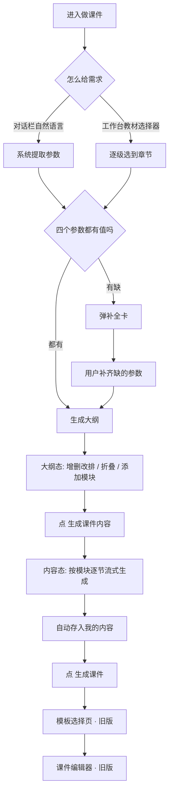
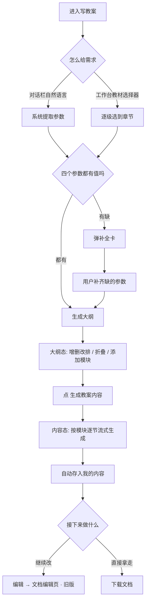
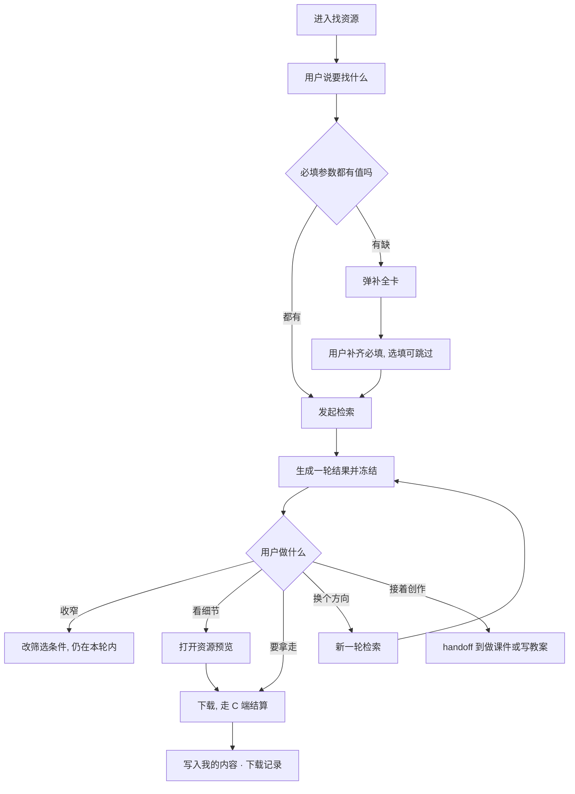

# 新版小博士 一期 PRD

> 版本：v4 初稿（全部章节已写，待逐场景细过）
> 更新：2026-07-28
> 线上旧版：<https://ai.xkw.com/chat?source=zc>
> 交互原型：<https://wzrong.me/xiaoboshi/>
> 埋点表：[数据/埋点与查询/AI 小博士埋点表.xlsx](../数据/埋点与查询/AI%20小博士埋点表.xlsx)
> 范围探讨过程：[计划/新版小博士一期范围探讨记录.md](新版小博士一期范围探讨记录.md)

---

## 一、背景与一期目标

新版整体重构，与线上旧版差异过大，一次性开发的周期不可控，因此分期推进。

一期核心是两件事：

1. 把新的框架和交互跑通，能上线验证。
2. 场景内部的能力逐期打磨。

这样每期目标明确，也避免框架和场景能力两条线同时改、最后谁都跑不起来。

一期的生成能力、模板页和编辑器都沿用旧版，改动集中在对话框架、工作台结构和交互层。

---

## 二、一期做什么

| 模块   | 一期内容                               |
| ---- | ---------------------------------- |
| 首页   | 智能对话框、左侧菜单重构、我的内容、历史对话、首次引导        |
| 意图路由 | 首页输入自动识别场景，分流到 4 个对话式场景            |
| 找资源  | 双栏检索工作台、检索轮次、信息补全、资源预览与下载          |
| 做课件  | 大纲编辑 + 详细内容生成，跳模板页与课件编辑器           |
| 写教案  | 大纲编辑 + 详细内容生成，跳文档编辑页或直接下载          |
| 画导图  | 导图生成与节点编辑                          |
| 通用助手 | 通用问答，兼作意图识别的落点和兜底                  |
| 共用组件 | 工作台外壳、对话栏、信息补全卡、教材选择器、大纲面板、正文与浮动目录 |

对话式场景一期共 4 个：找资源、做课件、写教案、画导图。通用助手不单独占入口，它是首页自由输入的兜底逻辑。

左侧菜单里的互动课件、智能组卷、教材百科、作文批改、AI 讲卷、AI 生图、智能体，一期作为入口保留，点击跳转旧版页面。

---

## 三、做课件

### 3.1 旧版现状

旧版做课件用的是结构化填空式输入。用户在输入栏里依次选「课程」「教材版本」「章节」三个参数，系统拼成一句话提交：

```text
课件生成  帮我写一篇  [高中语文] - [必修上册] - [第1课 沁园春·长沙/毛泽东]  教学课件
```

提交后系统生成课件大纲，用户可以增删改，确认后生成课件的详细内容。内容完成后跳到模板选择页挑一套模板，再进入课件编辑器完成最终成稿。

参数只能选，不支持自然语言输入。

### 3.2 一期要做的

把这条流程迁到新的「对话 + 工作台」框架里，同时在入口处增加自然语言输入的路径。

大纲生成逻辑、详细内容生成逻辑、模板选择页、课件编辑器都沿用旧版，本期不改。

### 3.3 整体流程



虚线以下（模板选择页、课件编辑器）是旧版页面，一期直接跳转。

### 3.4 页面结构

左右双栏。左侧是对话栏，右侧是工作台。中缝可拖拽调宽，对话栏最小 320px，工作台最小 380px。

工作台有三个状态：

| 状态 | 触发 | 内容 |
| --- | --- | --- |
| 初始态 | 刚进入，还没给需求 | 引导语 + 教材选择器入口 + 示例 |
| 大纲态 | 参数齐全，大纲已生成 | 大纲卡片 + 添加模块区 + 主按钮 |
| 内容态 | 用户确认大纲后 | 文档式正文 + 左侧浮动目录 |

大纲态和内容态的工作台顶部都有一条教材条，显示当前教材信息，点击可展开教材选择器更换。

**大纲态线框**

```text
┌─────────────────────┬──────────────────────────────────────────┐
│                     │  统编版·高中语文·必修上册·第1课   [切换]  │
│   对话栏             ├──────────────────────────────────────────┤
│                     │                                          │
│  ┌───────────────┐  │   ┌────────────────────────────────┐     │
│  │ AI: 我先把大纲 │  │   │ [图标] 第1课 沁园春·长沙/毛泽东 │     │
│  │ 列在右侧了…    │  │   ├────────────────────────────────┤     │
│  └───────────────┘  │   │ ⣿ 学习目标                 [删] │     │
│                     │   │ ⣿ 课堂导入                 [删] │     │
│                     │   │ ⣿ ▾ 探究新知               [删] │     │
│                     │   │      · 初读课文，概括梳理       │     │
│                     │   │      · 研读课文，合作探究       │     │
│                     │   │ ⣿ 课堂总结                 [删] │     │
│                     │   ├────────────────────────────────┤     │
│                     │   │ 添加模块                        │     │
│                     │   │  [+ 课堂练习] [+ 分层作业]      │     │
│                     │   └────────────────────────────────┘     │
│  ┌───────────────┐  │                                          │
│  │ 输入框     [↑]│  │      ┌──────────────────────┐            │
│  └───────────────┘  │      │    生成课件内容        │            │
└─────────────────────┴──────────────────────────────────────────┘
```

`⣿` 为拖拽手柄，`▾` 为折叠箭头。

**内容态线框**

```text
┌─────────────────────┬──────────────────────────────────────────┐
│                     │  统编版·高中语文·必修上册·第1课   [切换]  │
│   对话栏             ├────────────┬─────────────────────────────┤
│                     │  浮动目录   │                             │
│  ┌───────────────┐  │            │  学习目标                    │
│  │ AI: 正在按大纲 │  │  ✔ 学习目标 │  1. 梳理词作上下片结构…      │
│  │ 展开内容…      │  │            │  2. 品味炼字效果…            │
│  └───────────────┘  │  ◐ 课堂导入 │                             │
│                     │            │  课堂导入                    │
│                     │  ○ 探究新知 │  ▓▓▓▓▓▓▓▓▓▓▓ 生成中…        │
│                     │            │                             │
│                     │  ○ 课堂总结 │  探究新知                    │
│                     │            │  ░░░░░░░░░░░ 待生成          │
│  ┌───────────────┐  │            │                             │
│  │ 内容生成中… ⏹ │  │            │                             │
│  └───────────────┘  │            │                             │
└─────────────────────┴────────────┴─────────────────────────────┘
```

`✔` 已完成，`◐` 生成中，`○` 待生成。全部完成后工作台右下角出现「生成课件」按钮。

### 3.5 进入方式

| 入口 | 行为 |
| --- | --- |
| 首页场景 chip「做课件」 | 进入初始态，对话栏给出问候 |
| 首页自由输入被识别为做课件 | 携带原句进入，直接走参数提取 |
| 其他工作台内提出课件需求 | 切换过来，对话流插入切换分割线，携带原句 |

### 3.6 需求输入

两种方式并存，用户选哪种都行，两条路最终都汇到「生成大纲」这一步。

**自然语言输入**——在对话栏直接说，例如「帮我做一份沁园春·长沙的课件」。

**教材选择器**——用户点「做课件」进入工作台后，在工作台里手动打开教材选择器（点教材条，或初始态的选择入口），按 学段 → 学科 → 教材版本 → 册别 → 章节 逐级选。选到章节后系统开始**生成大纲**，不是直接生成内容。用户确认大纲没问题，才进入内容生成。

### 3.7 参数与信息补全

生成大纲需要四个参数：**学段、学科、教材版本、教材目录节点（章节）**。

这四个**都是必填的**，缺任何一个都没法生成。区别只在于值从哪来：

| 来源 | 说明 |
| --- | --- |
| 系统自动填 | 用户输入里直接带了，或系统能从主题反查出来 |
| 用户手动选 | 系统填不上的，在补全卡里让用户选 |

举个例子：用户说「沁园春·长沙的课件」，系统从主题反查到「统编版 · 高中语文 · 必修上册 · 第1课」，四个参数全部自动填上，不用弹补全卡。用户说「高中语文的课件」，只有学段和学科有值，教材版本和章节缺，补全卡弹出来问这两项。

**弹卡规则**

| 情况 | 处理 |
| --- | --- |
| 四个参数全有值 | 不弹卡，直接生成大纲，参数静默回填到教材条 |
| 有任意一个没值 | 弹补全卡 |
| 部分有值部分没值 | 弹补全卡，已有值的回填并可改，没值的高亮待填 |

补全卡里四项全部有值才能提交，提交后卡片消失、开始生成大纲。因为四项都是必填，卡片没有「跳过」——用户可以改已填的值，但不能在缺值的情况下关掉它。

补全卡的具体形态见「共用组件 · 信息补全卡」一节。

**补全卡线框**

```text
        ┌──────────────────────────────────────────┐
        │  再补两项就能开始                    [×]  │
        ├──────────────────────────────────────────┤
        │  学段    [小学] [初中] (高中) [中职]      │
        │  学科    [语文] [数学] [英语] [物理] …    │
        │  教材版本 [统编版] [人教版] [北师大版] …   │  ← 待填，高亮
        │  册别    [必修上册] [必修下册] …          │  ← 待填，高亮
        │  章节    第1课 沁园春·长沙/毛泽东          │
        ├──────────────────────────────────────────┤
        │  说点别的…                        [确定]  │
        └──────────────────────────────────────────┘
```

`( )` 为已选中，已有值的项正常展示可改，缺值的项高亮。四项齐全前「确定」置灰、`×` 不可点。

### 3.8 大纲态

用户确认参数后，工作台展示大纲卡片。

**卡片结构**

- 卡片头：章节名称，前置一个课件类型图标
- 模块列表：一级模块纵向排列
- 添加模块区：卡片底部
- 主按钮：卡片下方，「生成课件内容」

**一级模块**

每个一级模块一行，包含：

- 左侧拖拽手柄，按住可上下调整顺序
- 模块名称，点击可直接改字
- 右侧删除按钮
- 如果该模块有二级子项，名称前有折叠箭头

**二级子项**

缩进展示在父模块下方，同样支持新增、删除、改名、拖拽排序。父模块折叠时子项收起。

**添加模块**

卡片底部的添加区，列出当前大纲里没有的候选模块。候选集由后台按当前课程动态返回，不是写死的固定列表。做课件和写教案各有一套候选逻辑。

只能添加一级模块。二级子项通过在父模块下直接新增行来加。

**主按钮**

- 大纲至少保留一个模块时可点
- 大纲被删空时置灰，鼠标悬停提示「至少保留一个模块」

### 3.9 内容态

点「生成课件内容」后进入。

**布局**

工作台变成文档式正文，左侧挂一条浮动目录。顶部教材条保留。

**生成方式**

按大纲模块的顺序逐节流式输出。已完成的模块显示完整内容，正在生成的模块显示流式文字，还没轮到的模块显示占位。

**浮动目录**

列出全部模块，每项标注生成状态：

| 状态 | 标识 |
| --- | --- |
| 已完成 | 实心勾 |
| 生成中 | 转圈 |
| 待生成 | 空心圆，文字置灰 |

点目录项滚动到对应段落。生成过程中目录会跟着更新，用户能知道还剩几节。

**生成期间**

- 对话栏输入框置为不可用，placeholder 显示「内容生成中…」
- 输入框右下角的发送按钮变成停止按钮，点击可中断
- 中断后保留已生成的部分，对话栏给出重新生成的入口

### 3.10 自动保存

全部模块生成完成时，系统自动把这份课件内容存入「我的内容」，不需要用户点保存。

一期不做去重，每次生成都存一条。同一课题反复生成会有多条并存，用户可以在「我的内容」里单条删除。

### 3.11 收尾：跳模板选择

内容全部生成完成后，工作台底部出现「生成课件」按钮。

点击后跳转到旧版的模板选择页。用户在那里按学科筛选模板、预览封面效果，点「生成课件」进入课件编辑器完成成稿。

模板选择页和课件编辑器都是旧版已有页面，一期直接跳转，不重做也不内嵌。后续如果要提升体验，再考虑把编辑器嵌进工作台。

### 3.12 文案

| 位置 | 文案 |
| --- | --- |
| 初始态标题 | 来做课件吧 |
| 初始态引导 | 告诉我课题，或者从右上角选教材章节 |
| AI 首句 | 好的，我来帮你做课件。告诉我课题，或者在右侧选好教材章节，我先给你列个大纲。 |
| 参数齐全，开始出大纲 | 我先把《{章节名}》的课件大纲列在右侧了，你可以增删条目、调整顺序或改名字。满意后点「生成课件内容」，我再展开每一部分。 |
| 确认大纲后 | 好的，正在按大纲展开《{章节名}》的课件内容… |
| 内容生成完 | 《{章节名}》的课件内容已经生成好了，共 {n} 个模块。点右下角「生成课件」就可以挑模板、进编辑器成稿。 |
| 大纲被删空 | 至少保留一个模块才能生成 |
| 生成中断 | 已停止生成。已完成的部分保留在右侧，你可以接着改大纲重新生成。 |
| 生成失败 | 生成没成功，可能是网络问题。点这里重试。 |
| 补全卡标题 · 全缺 | 告诉我给哪节课做课件 |
| 补全卡标题 · 部分缺 | 再补 {n} 项就能开始 |
| 补全卡提交后 | 好的，{教材版本} · {学科} · {册别} · {章节名}，我这就列大纲。 |
| 从别的场景切过来 | 已切到「做课件」 |
| 反查不到教材节点 | 这个课题我没在教材目录里找到，你从下面选一下是哪一册哪一节。 |

### 3.13 异常处理

| 场景 | 处理 |
| --- | --- |
| 主题反查不到教材节点 | 补全卡把学段、学科、教材版本升为必填，用户手动选 |
| 大纲生成失败 | 对话栏给失败提示 + 重试入口，工作台保持初始态 |
| 内容生成中途失败 | 保留已完成模块，失败的模块标红并给单节重试 |
| 用户在生成中途发新消息 | 消息进对话队列，生成完成后再处理，不打断当前生成 |
| 用户在内容态改教材 | 提示「换教材会重新生成大纲，当前内容会保留在我的内容里」，确认后回到大纲态 |
| 大纲被删到空 | 主按钮置灰，不允许提交 |

### 3.14 案例走查

主线案例走完整条路径，分支案例只写与主线不同的步骤。案例里的 AI 文案与 3.12 一一对应，可直接作为验收依据。

**一条通用原则：不是每个动作都需要 AI 回话。** 用户在工作台里拖模块、改名字、点折叠，这些是直接操作，AI 保持沉默；只有涉及状态推进（开始生成、生成完成、需要用户补信息）时，对话栏才出声。否则用户每动一下 AI 就说一句，对话流会被噪音淹没。

---

#### 案例 A · 一句话说清需求（主线）

李老师要备《沁园春·长沙》这节课，想先做一份课件。

**第 1 步**　李老师在首页点了场景 chip「做课件」。

- 界面：进入做课件工作台，左对话右工作台，工作台是初始态，中间显示「来做课件吧 / 告诉我课题，或者从右上角选教材章节」
- AI：好的，我来帮你做课件。告诉我课题，或者在右侧选好教材章节，我先给你列个大纲。

**第 2 步**　李老师在对话栏输入「沁园春长沙的课件」，回车。

- 系统：提取到主题「沁园春·长沙」，反查教材目录命中「统编版 · 高中语文 · 必修上册 · 第1课」，四项参数齐全
- 界面：不弹补全卡；工作台顶部出现教材条「统编版 · 高中语文 · 必修上册 · 第1课　[切换]」；工作台从初始态切到大纲态，卡片里列出学习目标、课堂导入、探究新知（含两个子项）、课堂总结
- AI：我先把《第1课 沁园春·长沙/毛泽东》的课件大纲列在右侧了，你可以增删条目、调整顺序或改名字。满意后点「生成课件内容」，我再展开每一部分。

**第 3 步**　李老师觉得少了练习环节，点了添加区的「+ 课堂练习」。

- 界面：「课堂练习」追加到大纲末尾，同时从添加区消失
- AI：不出声

**第 4 步**　李老师把「课堂总结」拖到了「课堂练习」下面。

- 界面：两个模块位置对调
- AI：不出声

**第 5 步**　李老师点「生成课件内容」。

- 界面：工作台切到内容态，左侧浮动目录列出 5 个模块全部标为待生成；正文区开始按顺序出内容；对话栏输入框置灰，placeholder 变成「内容生成中…」，发送按钮变成停止按钮
- AI：好的，正在按大纲展开《第1课 沁园春·长沙/毛泽东》的课件内容…

**第 6 步**　内容逐节生成，约 40 秒后全部完成。

- 界面：浮动目录 5 项全部打勾；正文完整展示；输入框恢复可用；工作台右下角出现「生成课件」按钮
- 系统：这份内容自动写入「我的内容」，李老师不用做任何操作
- AI：《第1课 沁园春·长沙/毛泽东》的课件内容已经生成好了，共 5 个模块。点右下角「生成课件」就可以挑模板、进编辑器成稿。

**第 7 步**　李老师点「生成课件」。

- 界面：跳转到模板选择页，学科 tab 默认停在「语文」，右侧列出语文模板，左侧大图预览第一套模板的封面效果
- 后续：选模板 → 点「生成课件」→ 进课件编辑器，这两步都是旧版页面，本期不改

---

#### 案例 B · 什么都没说

李老师点进来之后只说了「帮我做个课件」。

**与主线的差异在第 2 步。**

- 系统：四项参数一个都提取不到
- 界面：对话流里弹出补全卡，标题「告诉我给哪节课做课件」，学段、学科、教材版本、册别、章节五行全部高亮待填，「确定」置灰，`×` 不可点
- AI：不额外出声，补全卡本身就是提问

李老师依次点选高中 → 语文 → 统编版 → 必修上册 → 第1课，点「确定」。

- 界面：补全卡收起，对话流里留下一条已选参数的记录；教材条出现；工作台进大纲态
- AI：好的，统编版 · 高中语文 · 必修上册 · 第1课，我这就列大纲。

之后与主线第 3 步起一致。

---

#### 案例 C · 说了一半

李老师说「高中语文的课件」。

**与主线的差异在第 2 步。**

- 系统：提取到学段「高中」和学科「语文」，教材版本和章节没有值
- 界面：弹出补全卡，标题「再补 2 项就能开始」；学段和学科两行已回填并可改，教材版本和册别、章节高亮待填
- AI：不额外出声

李老师补完点「确定」，之后与案例 B 一致。

---

#### 案例 D · 不打字，直接选教材

李老师点进来后没在对话栏说话，直接点了工作台的教材选择器。

**与主线的差异在第 2 步。**

- 界面：右侧滑出教材选择器抽屉，按 学段 → 学科 → 教材版本 → 册别 → 章节 逐级展开
- 李老师选到「统编版 · 高中语文 · 必修上册 · 第1课 沁园春·长沙」，点确认
- 界面：抽屉关闭，教材条出现，工作台进大纲态（**不是直接生成内容**）
- AI：我先把《第1课 沁园春·长沙/毛泽东》的课件大纲列在右侧了，你可以增删条目、调整顺序或改名字。满意后点「生成课件内容」，我再展开每一部分。

之后与主线第 3 步起一致。

---

#### 案例 E · 生成到一半不想要了

内容生成到第 3 个模块时，李老师发现大纲里漏了个东西，点了停止。

**接主线第 5 步之后。**

- 界面：生成立即停止；浮动目录前 2 项保持打勾，第 3 项停在生成中的状态，后 2 项仍是待生成；正文保留已生成的部分；输入框恢复可用
- AI：已停止生成。已完成的部分保留在右侧，你可以接着改大纲重新生成。

李老师此时可以从教材条旁边的返回入口回到大纲态，改完大纲再点一次「生成课件内容」。重新生成会覆盖当前内容，不叠加。

---

#### 案例 F · 从找资源里顺手做课件

李老师本来在找资源里搜《沁园春·长沙》的资料，看完之后想做个课件，直接在对话栏说「给这节课做个课件」。

**与主线的差异在第 1、2 步。**

- 系统：在找资源工作台内识别出做课件意图，命中白名单，触发场景切换；把找资源当前上下文里的教材信息带过去
- 界面：对话流插入一条切换分割线「已切到「做课件」」，右侧带「切回」；工作台从检索结果切成做课件的大纲态；对话历史不中断，之前找资源的对话仍在上方
- AI：我先把《第1课 沁园春·长沙/毛泽东》的课件大纲列在右侧了，你可以增删条目、调整顺序或改名字。满意后点「生成课件内容」，我再展开每一部分。

因为教材信息是从找资源的上下文里带过来的，这里不需要再问一遍，直接出大纲。之后与主线第 3 步起一致。

### 3.15 埋点

沿用旧版命名规则 `ai_doctor_<模块>_<动作>`，事件类型为 click。

**沿用旧版**

| 事件 | element_name |
| --- | --- |
| 侧边栏入口 | `menu-courseware_generate_button_click` |
| 会话框顶部入口 | `ai_doctor_inputbox_upper_click_courseware_gen` |
| 消息发送 | `ai_doctor_gen_courseware_send` |
| 生成课件内容 | `generate-courseware-new` |
| 生成课件 | `ai_doctor_gen_courseware_gen_ppt` |
| 下载 | `ai_doctor_gen_courseware_download` |

**本期新增**

| 事件 | 说明 |
| --- | --- |
| 教材条点击 | 展开教材选择器 |
| 切换教材 | 带新旧教材参数 |
| 大纲新增模块 | 带模块名 |
| 大纲删除模块 | 带模块名、层级 |
| 大纲改名 | 带层级 |
| 大纲拖拽排序 | 带层级 |
| 大纲折叠展开 | 带模块名 |
| 添加模块候选点击 | 带模块名 |
| 浮动目录跳转 | 带模块名 |
| 生成中断 | 带已完成模块数 |
| 单节重试 | 带模块名 |

旧版的「保存我的空间」click 埋点作废，改为自动保存成功的记录。

### 3.16 验收标准

1. 从首页 chip 进入，工作台显示初始态，对话栏有问候语。
2. 在对话栏输入「沁园春·长沙的课件」，系统能反查出教材节点，不弹补全卡，直接出大纲，教材条显示「统编版 · 高中语文 · 必修上册 · 第1课」。
3. 在对话栏输入「帮我做个课件」，补全卡弹出，四项都待填；四项没齐时「确定」置灰、卡片无法关闭。
4. 在对话栏输入「高中语文的课件」，补全卡弹出，学段和学科已回填并可改，教材版本和章节高亮待填。
5. 通过教材选择器逐级选到章节，先出大纲而不是直接生成内容。
6. 大纲的一级和二级模块都能新增、删除、改名、拖拽排序。
7. 有子项的一级模块能折叠，折叠后子项隐藏。
8. 添加模块区只显示当前大纲里没有的候选，添加后从候选区消失。
9. 大纲删空后主按钮置灰。
10. 点「生成课件内容」后按模块顺序逐节生成，浮动目录实时更新每节状态。
11. 生成过程中输入框不可用，可点停止中断，中断后已完成内容保留。
12. 全部生成完成后自动写入「我的内容」，能在我的内容里看到并删除。
13. 点「生成课件」跳到模板选择页，参数正确带过去。
14. 在内容态更换教材时有二次确认提示。

---

## 四、写教案

写教案和做课件是同一条流程，共用同一套组件。本节只写两者不同的地方，相同的部分直接引用第三章。

### 4.1 旧版现状

和做课件一样，旧版写教案也是结构化填空式输入，选「课程」「教材版本」「章节」三个参数拼成一句话提交。提交后出大纲，用户改完确认，生成教案的详细内容。

区别在收尾：教案的产物是文档，不是 PPT，所以没有模板选择环节。内容生成完之后，用户可以点「编辑」跳文档编辑页继续改，也可以直接「下载」拿走。

### 4.2 一期要做的

和做课件同样的迁移：把流程搬进新的「对话 + 工作台」框架，入口增加自然语言输入。生成逻辑、文档编辑页都沿用旧版。

### 4.3 与做课件的差异

| 环节 | 做课件 | 写教案 |
| --- | --- | --- |
| 大纲主按钮 | 生成课件内容 | 生成教案内容 |
| 添加模块候选集 | 后台按课程返回课件侧候选 | 后台按课程返回教案侧候选，与课件各一套 |
| 收尾 | 「生成课件」→ 模板选择页 → 课件编辑器 | 「编辑」→ 文档编辑页；「下载」→ 直接下载文档 |
| 模板选择 | 有 | 无 |

除此之外，进入方式、需求输入、参数与补全、大纲态的所有交互、内容态的正文与浮动目录、自动保存，全部与做课件一致，见 3.5 到 3.10。

### 4.4 整体流程



### 4.5 收尾

内容全部生成完成后，工作台底部出现两个按钮，并列摆放：

| 按钮 | 行为 |
| --- | --- |
| 编辑 | 跳转旧版文档编辑页，带上当前教案内容，用户在那里继续改 |
| 下载 | 直接下载文档文件，不离开当前页面 |

「编辑」是主按钮样式，「下载」是次级按钮样式。两个动作互不冲突，用户可以先下载再去编辑，也可以只做其中一件。

文档编辑页是旧版已有页面，一期直接跳转，不重做也不内嵌。

### 4.6 文案

除下表列出的以外，其余文案与做课件一致，把「课件」替换为「教案」即可。

| 位置 | 文案 |
| --- | --- |
| 初始态标题 | 来写教案吧 |
| 初始态引导 | 告诉我课题，或者从右上角选教材章节 |
| AI 首句 | 好的，我来帮你写教案。告诉我课题，或者在右侧选好教材章节，我先给你列个大纲。 |
| 参数齐全，开始出大纲 | 我先把《{章节名}》的教案大纲列在右侧了，你可以增删条目、调整顺序或改名字。满意后点「生成教案内容」，我再展开每一部分。 |
| 确认大纲后 | 好的，正在按大纲展开《{章节名}》的教案内容… |
| 内容生成完 | 《{章节名}》的教案已经写好了，共 {n} 个模块。可以点「编辑」继续改，也可以直接下载。 |
| 从别的场景切过来 | 已切到「写教案」 |

### 4.7 异常处理

与做课件一致，见 3.13。只有一条不同：

| 场景 | 处理 |
| --- | --- |
| 下载失败 | 提示「下载没成功，请重试」，保留页面状态，不影响已生成内容 |

### 4.8 案例走查

分支情况（信息缺失、走教材选择器、生成中断、从别的场景切过来）与做课件的案例 B 到 F 完全一致，把场景名和按钮文案替换即可，这里不重复。只写一条主线。

---

#### 案例 A · 从找资源顺手写教案（主线）

李老师刚在找资源里下载了一份《沁园春·长沙》的课件，想接着把教案也写了。

**第 1 步**　李老师在对话栏说「再帮我写份教案」。

- 系统：在找资源工作台内识别出写教案意图，命中白名单，携带当前上下文里的教材信息切换场景
- 界面：对话流插入切换分割线「已切到「写教案」」，右侧带「切回」；工作台从检索结果切成写教案的大纲态；教材条显示「统编版 · 高中语文 · 必修上册 · 第1课」；之前找资源的对话仍在上方，没有中断
- AI：我先把《第1课 沁园春·长沙/毛泽东》的教案大纲列在右侧了，你可以增删条目、调整顺序或改名字。满意后点「生成教案内容」，我再展开每一部分。

**第 2 步**　李老师看了眼大纲，觉得「教学反思」这块自己会写，不用 AI 生成，点了删除。

- 界面：「教学反思」从大纲移除，同时回到底部添加区变成可选项
- AI：不出声

**第 3 步**　李老师点「生成教案内容」。

- 界面：工作台切内容态，浮动目录列出剩余模块全部标为待生成；正文按顺序流式输出；输入框置灰，placeholder 变「内容生成中…」
- AI：好的，正在按大纲展开《第1课 沁园春·长沙/毛泽东》的教案内容…

**第 4 步**　内容生成完成。

- 界面：浮动目录全部打勾；正文完整；输入框恢复；工作台底部出现「编辑」和「下载」两个按钮
- 系统：这份教案自动写入「我的内容」
- AI：《第1课 沁园春·长沙/毛泽东》的教案已经写好了，共 7 个模块。可以点「编辑」继续改，也可以直接下载。

**第 5 步**　李老师觉得教学过程那段还想调，点了「编辑」。

- 界面：跳转到旧版文档编辑页，教案内容已带过去
- 后续：在文档编辑页继续修改，这一步是旧版页面，本期不改

### 4.9 埋点

沿用旧版命名规则，事件类型为 click。

**沿用旧版**

| 事件 | element_name |
| --- | --- |
| 侧边栏入口 | `menu-teaching_design_generate_button_click` |
| 会话框顶部入口 | `ai_doctor_inputbox_upper_click_teaching_design_gen` |
| 消息发送 | `ai_doctor_teaching_design_send` |
| 生成教学设计 | `generate-teaching-design-new` |
| 编辑按钮 | `ai_doctor_teaching_design_edit` |
| 下载按钮 | `ai_doctor_download_teaching_design` |

**本期新增**

与做课件新增的埋点一一对应，模块名换成教案侧：教材条点击、切换教材、大纲增删改排、大纲折叠展开、添加模块候选点击、浮动目录跳转、生成中断、单节重试。

旧版的「保存我的空间」click 埋点作废，改为自动保存成功的记录。

### 4.10 验收标准

1. 从首页 chip 进入，工作台显示初始态，对话栏问候语说的是「写教案」不是「做课件」。
2. 参数提取、补全卡、教材选择器三条路径的行为与做课件一致。
3. 大纲主按钮文案是「生成教案内容」。
4. 添加模块的候选集与做课件不同，取的是教案侧的候选。
5. 内容生成完成后，工作台底部出现「编辑」和「下载」两个按钮，没有「生成课件」按钮，也不跳模板选择页。
6. 点「编辑」跳转旧版文档编辑页，教案内容正确带过去。
7. 点「下载」直接下载文档，不离开当前页面。
8. 内容生成完成后自动写入「我的内容」。
9. 从找资源切过来时，教材信息从上下文带入，不重复弹补全卡。

---

## 五、找资源

### 5.1 旧版现状

旧版找资源是单栏对话式。用户在对话框里说要找什么，系统返回一组资料，用户可以点开预览，觉得合适就下载。下载走学科网资源 C 端的结算逻辑。

功能比较薄：搜、预览、下载三步，没有筛选收窄，也没有历史结果回看——搜了第二次，第一次的结果就找不回来了。

### 5.2 一期要做的

把找资源从单栏对话改成左右双栏：左边保持对话，右边是常驻的结果区。同时补上旧版缺的两块——结果筛选和历史轮次回看。

检索能力、资源数据、下载结算都沿用旧版，改动集中在结果的呈现和操作方式。

一期只做单份资料。视频和专辑旧版没有，本期不做，结果区不设分类 tab。

### 5.3 整体流程



### 5.4 页面结构

左右双栏，与其他工作台同构。左边对话栏，右边结果区。中缝可拖拽，对话栏最小 320px，结果区最小 380px。

结果区有三个状态：

| 状态 | 触发 | 内容 |
| --- | --- | --- |
| 初始态 | 刚进入，还没检索过 | 引导语 + 示例 |
| 结果态 | 有检索结果 | 筛选条 + 资源卡片列表 |
| 预览态 | 打开某个资源 | 资源详情 + 追问条，可返回列表 |

**结果态线框**

```text
┌─────────────────────┬──────────────────────────────────────────┐
│                     │ 学段▾ 学科▾ 版本▾ 类型▾ 难度▾   共 24 份 │
│   对话栏             ├──────────────────────────────────────────┤
│                     │  ┌────────────────────────────────────┐  │
│  ┌───────────────┐  │  │ 人教版数学七上 1.2 有理数 同步练习  │  │
│  │ 用户: 七上有理 │  │  │ 匹配 98%  三审三校  6页 24题        │  │
│  │ 数的同步练习   │  │  │ 3.2万下载  2025-08 更新             │  │
│  └───────────────┘  │  │ #有理数 #随堂 #含答案               │  │
│  ┌───────────────┐  │  │                    [预览]  [下载]   │  │
│  │ AI: 找到 24 份 │  │  └────────────────────────────────────┘  │
│  │ [已匹配24个]   │  │  ┌────────────────────────────────────┐  │
│  └───────────────┘  │  │ 《有理数及其运算》单元检测卷 A卷    │  │
│  ┌───────────────┐  │  │ 匹配 95%  三审三校  4页 22题        │  │
│  │ 建议: 换成中等 │  │  │                    [预览]  [下载]   │  │
│  │ 难度 / 只要试卷│  │  └────────────────────────────────────┘  │
│  └───────────────┘  │                                          │
│  ┌───────────────┐  │  ── 接着做点什么 ──────────────────────  │
│  │ 输入框     [↑]│  │   [生成配套教案]   [做成课件]            │
│  └───────────────┘  │                                          │
└─────────────────────┴──────────────────────────────────────────┘
```

对话流里的 `[已匹配24个]` 是结果 pill，点击可把结果区切回这一轮。

**预览态线框**

```text
┌─────────────────────┬──────────────────────────────────────────┐
│                     │ [← 返回列表]   人教版数学七上 1.2 同步练习 │
│   对话栏             ├──────────────────────────────────────────┤
│                     │                                          │
│                     │        ┌────────────────────┐            │
│                     │        │                    │            │
│                     │        │    文档内容预览      │            │
│                     │        │                    │            │
│                     │        └────────────────────┘            │
│                     │                                          │
│                     │  ── 关于这份资料 ──────────────────────   │
│  ┌───────────────┐  │   [难度怎么样]  [有答案吗]  [适合几年级] │
│  │ 输入框     [↑]│  │                                          │
│  └───────────────┘  │                        [下载]            │
└─────────────────────┴──────────────────────────────────────────┘
```

### 5.5 进入方式

| 入口 | 行为 |
| --- | --- |
| 首页场景 chip「找资源」 | 进入初始态，对话栏给出问候 |
| 首页自由输入被识别为找资源 | 携带原句进入，直接走参数提取 |
| 其他工作台内提出找资料需求 | 切换过来，对话流插入切换分割线，携带原句 |

### 5.6 参数与信息补全

找资源的参数比做课件多，而且分必填和选填。

| 参数 | 必填/选填 | 说明 |
| --- | --- | --- |
| 学段 | 必填 | 小学 / 初中 / 高中 / 中职 |
| 学科 | 必填 | 语文、数学、英语… |
| 资料类型 | 必填 | 课件 / 试卷 / 教案 / 学案 / 作业 |
| 年级 | 选填 | 备课类资料常用 |
| 学期 | 选填 | 上册 / 下册 |
| 主题 | 选填 | 具体知识点或章节 |
| 场景 | 选填 | 开学 / 周测 / 期中 / 期末 / 一模… |

**和做课件的区别**：做课件必须落到具体章节才能生成，所以四个参数全必填、不能跳过。找资源不一样——模糊一点也能出结果，只是结果没那么准。所以只有三个参数是必填的，其余可以跳过，也可以选「不限」。

**弹卡规则**

| 情况 | 处理 |
| --- | --- |
| 三个必填都有值 | 不弹卡，直接检索 |
| 必填有缺 | 弹补全卡，必填未齐时「确定」置灰 |
| 必填齐了但选填空着 | 弹卡，但「跳过」可点，用户可以直接跳过去检索 |

**「不限」**

选填字段各带一个「不限」。选了「不限」这一行不再高亮，但这个字段不进检索条件。它和「跳过」的区别是：跳过是把整张卡放一边，「不限」是明确表态「这一项我不在乎」。

**跳过之后**

用户跳过一次后，同一会话内不再因为模糊输入反复弹卡。除非用户后面又说出了新的明确信息（比如补了年级或场景），才重新激活补全。

这条规则是为了避免用户被追着问——他已经表示不想填了，就别再问第二遍。

补全卡的形态见 10.3。

### 5.7 检索轮次

**每一次检索产生一轮结果，这一轮被冻结保存。**

用户后面又搜了别的，之前那一轮不会被覆盖。对话流里每条 AI 检索回复都带一个结果 pill，显示这轮匹配到多少份，点击就能把右边切回那一轮。

这是本期新增的，旧版没有——旧版搜第二次，第一次的结果就丢了。

**什么算新的一轮**

| 动作 | 是否新轮 |
| --- | --- |
| 在对话栏说新的检索需求 | 是 |
| 补全卡提交后触发的检索 | 是（与触发它的那句合并为一轮） |
| 改结果区顶部的筛选条件 | 否，在当前轮内收窄 |
| 点历史结果 pill 回看 | 否，只是切换展示 |

筛选是在已有结果里收窄，不重新发起检索，也就不产生新轮。这一点要和「换个搜法」区分开——用户改筛选是想在这批结果里挑，不是想换一批。

**跨场景保留**

用户切到别的场景再切回来，之前所有轮次仍在，结果 pill 仍可点。

### 5.8 结果列表与资源卡片

**筛选条**

结果区顶部一排下拉：学段、学科、版本、资料类型、难度。右侧显示当前结果数。改筛选即时生效，在当前轮内收窄。

**资源卡片**

每张卡片展示这些信息：

| 信息 | 说明 |
| --- | --- |
| 标题 | 资料全名 |
| 匹配度 | 与检索条件的匹配百分比 |
| 权威标 | 三审三校标识 |
| 规格 | 页数、题数 |
| 热度 | 下载量 |
| 时间 | 更新时间 |
| 标签 | 知识点、用途等标签 |
| 操作 | 预览、下载 |

匹配度和三审三校标是信任建立的关键信息，位置要靠前。

### 5.9 资源预览与下载

**预览**

点卡片上的「预览」进入预览态，结果区变成资源详情。顶部有返回列表的入口，返回后回到原来的轮次和滚动位置。

**下载**

预览态和列表态都能下载，行为一致：

1. 点「下载」
2. 走学科网资源 C 端的结算逻辑——权益判断、扣减或引导购买都在 C 端完成，小博士这边不做这套逻辑
3. 结算通过后开始下载
4. 下载成功后写入「我的内容 · 下载记录」

用户如果没有权益，C 端会引导他去购买，这部分流程不在本期范围内，小博士只负责把请求交过去、拿到结果后记录。

### 5.10 追问

分两种，位置和内容都不一样。

**轮次追问推荐**

每轮结果出来后，在对话栏的 AI 回复下方给几条建议，引导用户收窄或换方向。内容跟着这轮的检索条件走，例如「换成中等难度」「只要试卷」「加上期末场景」。

**单资源追问**

打开某份资料的预览后，详情下方给一排针对这份资料的追问，例如「难度怎么样」「有答案吗」「适合几年级」。

点了之后 AI 在对话栏回答，结果区保持在当前预览不动——用户是在了解这份资料，不该被切走。

### 5.11 场景 handoff

结果区底部给两个入口：**生成配套教案**、**做成课件**。

点击后携带当前检索上下文里的教材信息切到目标场景。因为教材信息是带过去的，目标场景不需要再弹一次补全卡，直接出大纲。

一期只有这两个入口。旧版原型里还有「直接出一份卷子」，指向不在本期范围的出卷子场景，本期不做。

### 5.12 文案

| 位置 | 文案 |
| --- | --- |
| 初始态标题 | 来找资料吧 |
| 初始态引导 | 告诉我你要找什么，我从学科网资源库里挑 |
| AI 首句 | 你好老师，告诉我你要找什么——哪个学段学科、什么类型的资料，我从学科网资源库为你精准匹配。 |
| 补全卡标题 · 必填缺 | 先告诉我这三项 |
| 补全卡标题 · 只缺选填 | 再补几项能找得更准 |
| 检索中 | 正在从资源库里找… |
| 有结果 | 找到 {n} 份符合的资料，都在右侧了。可以改筛选条件收窄，也可以告诉我换个方向。 |
| 无结果 | 这个条件下没找到合适的。要不要放宽一点——比如去掉难度限制，或者换个资料类型？ |
| 筛选后无结果 | 当前筛选下没有资料了，试试放宽条件。 |
| 跳过补全后 | 好的，我先按现有条件找，结果不理想的话你再告诉我更多信息。 |
| 下载成功 | 已下载，可以在「我的内容」里找到。 |
| 下载失败 | 下载没成功，请重试。 |
| 从别的场景切过来 | 已切到「找资源」 |

### 5.13 异常处理

| 场景 | 处理 |
| --- | --- |
| 检索无结果 | 对话栏给放宽建议，结果区显示空态并提示可调整的条件 |
| 筛选后无结果 | 结果区空态，提示放宽筛选，保留筛选条让用户改回去 |
| 检索失败 | 对话栏给失败提示 + 重试入口，上一轮结果保持不变 |
| 预览加载失败 | 预览区显示加载失败 + 重试，下载按钮仍可用 |
| 下载无权益 | 交给 C 端结算流程处理，小博士不拦截也不额外提示 |
| 下载失败 | 提示重试，不写入下载记录 |
| 用户在预览态发起新检索 | 自动返回列表态并开始新一轮，不停留在旧资料上 |

### 5.14 案例走查

#### 案例 A · 说得挺全，一次就找到（主线）

李老师要给七年级上的有理数这节课找套练习。

**第 1 步**　李老师在首页输入框直接打「人教版七上有理数的同步练习，要有答案」。

- 系统：意图识别命中找资源，提取到学段初中、学科数学、资料类型作业、主题有理数，三个必填齐全
- 界面：进入找资源工作台，不弹补全卡，结果区显示检索中
- AI：正在从资源库里找…

**第 2 步**　约 1 秒后结果返回。

- 界面：结果区显示筛选条和 24 张资源卡片，第一张匹配度 98%；对话流里的 AI 回复带一个「已匹配 24 个」的结果 pill；回复下方给出三条追问建议
- AI：找到 24 份符合的资料，都在右侧了。可以改筛选条件收窄，也可以告诉我换个方向。

**第 3 步**　李老师觉得结果有点多，把筛选条的「难度」改成「基础」。

- 界面：结果即时收窄到 9 份，筛选条右侧的计数跟着变
- 系统：这是当前轮内的收窄，**不产生新的一轮**，对话流里也不新增消息
- AI：不出声

**第 4 步**　李老师点第一张卡片的「预览」。

- 界面：结果区切到预览态，展示文档内容；顶部有「← 返回列表」；下方给出三条针对这份资料的追问
- AI：不出声

**第 5 步**　李老师点了追问「有答案吗」。

- 界面：结果区保持在预览不动
- AI：这份是含答案和解析的，最后两页是参考答案，一共 24 题。

**第 6 步**　李老师点「下载」。

- 系统：把下载请求交给学科网资源 C 端，走完权益判断和结算，返回成功
- 界面：下载开始
- AI：已下载，可以在「我的内容」里找到。
- 系统：这条下载写入「我的内容 · 下载记录」

---

#### 案例 B · 说得太笼统

李老师只说了「找点资料」。

**与主线的差异在第 1 步。**

- 系统：三个必填一个都提取不到
- 界面：弹出补全卡，标题「先告诉我这三项」，学段、学科、资料类型三行高亮待填；年级、学期、主题、场景四行是选填，各带一个「不限」；「确定」置灰，「跳过」也不可点（必填没齐时跳过没有意义）
- AI：不额外出声

李老师选了初中、数学、作业，其余留空，点「确定」。

- 界面：补全卡收起，开始检索
- AI：正在从资源库里找…

之后与主线第 2 步起一致，只是结果范围更宽。

---

#### 案例 C · 必填齐了，不想填选填

李老师说「初中数学的练习题」。

**与主线的差异在第 1 步。**

- 系统：三个必填齐了，四个选填都空
- 界面：弹出补全卡，标题「再补几项能找得更准」；必填三行已回填；选填四行待选，各有「不限」；「确定」和「跳过」都可点
- 李老师嫌麻烦，点了「跳过」
- AI：好的，我先按现有条件找，结果不理想的话你再告诉我更多信息。

**之后同会话内不再弹补全卡。** 李老师接着说「换成有难度一点的」，系统直接按现有上下文重新检索，不再追问选填。

除非他后面说了「要期末的」这种带新明确信息的话——这时补全重新激活，可以再弹一次。

---

#### 案例 D · 搜了第二轮，想回看第一轮

接主线第 6 步之后。

**第 7 步**　李老师又说「再找找一元一次方程的」。

- 界面：结果区切成新一轮的结果；对话流里新增一条 AI 回复，带新的结果 pill
- 系统：这是新的一轮；第一轮的结果被冻结保留，没有被覆盖

**第 8 步**　李老师想再看看刚才那批有理数的，点了对话流里上一条回复的「已匹配 24 个」pill。

- 界面：结果区切回第一轮，**筛选条件保持在他当时改过的「基础」难度**，滚动位置也回到当时的位置
- 系统：这不是新检索，只是切换展示
- AI：不出声

---

#### 案例 E · 找完资料顺手做课件

接主线第 6 步之后。

**第 7 步**　李老师下载完练习，想再做个课件，点了结果区底部的「做成课件」。

- 系统：把当前检索上下文里的教材信息（人教版 · 初中数学 · 七年级上册 · 有理数）带给做课件场景
- 界面：对话流插入切换分割线「已切到「做课件」」，右侧带「切回」；工作台切成做课件的大纲态；找资源的对话仍在上方
- AI：我先把《1.2 有理数》的课件大纲列在右侧了，你可以增删条目、调整顺序或改名字。满意后点「生成课件内容」，我再展开每一部分。

因为教材信息是带过来的，这里不再弹补全卡。之后走做课件的流程，见 3.14 案例 A 第 3 步起。

### 5.15 埋点

**沿用旧版**

| 事件 | element_name |
| --- | --- |
| 会话框顶部入口 | `smart_search_button_click` |
| 消息发送 | `ai_doctor_smart_search_send` |
| 资料预览 | `click_agent_list_item` |
| 下载 | `details_buybtn` |

**本期新增**

| 事件 | 说明 |
| --- | --- |
| 筛选条件变更 | 带字段名和新值 |
| 结果 pill 点击 | 带轮次序号 |
| 返回列表 | 从预览态返回 |
| 轮次追问建议点击 | 带建议文案 |
| 单资源追问点击 | 带资料 id 和追问文案 |
| handoff 生成配套教案 | 带资料 id |
| handoff 做成课件 | 带资料 id |
| 下载成功写入记录 | 带资料 id |
| 补全卡跳过 | 找资源特有 |
| 「不限」选择 | 带字段名 |

### 5.16 验收标准

1. 从首页 chip 进入，结果区是初始态，对话栏有问候语。
2. 输入完整需求（含学段、学科、资料类型）不弹补全卡，直接检索。
3. 输入「找点资料」弹补全卡，三个必填高亮，必填没齐时「确定」和「跳过」都不可点。
4. 输入「初中数学的练习题」弹补全卡，必填已回填，选填待选，「跳过」可点。
5. 选填字段各有一个「不限」，选了之后该行不再高亮，且不进检索条件。
6. 跳过补全后，同会话内的模糊输入不再弹卡；带来新明确信息时重新激活。
7. 每次检索产生一轮结果，对话流里对应一个结果 pill。
8. 改筛选条件在当前轮内收窄，不产生新轮，对话流不新增消息。
9. 点历史结果 pill 能切回那一轮，筛选状态和滚动位置都保持。
10. 切到别的场景再切回来，所有历史轮次仍在、pill 仍可点。
11. 资源卡片上匹配度和三审三校标在显著位置。
12. 点预览进入预览态，返回后回到原轮次和滚动位置。
13. 在预览态点单资源追问，AI 在对话栏回答，结果区不切走。
14. 下载走 C 端结算，成功后写入「我的内容 · 下载记录」。
15. 检索无结果时给出放宽建议，筛选无结果时保留筛选条可改回。
16. 点「做成课件」或「生成配套教案」，教材信息带过去，目标场景不重复弹补全卡。
17. 结果区不出现视频、专辑的分类 tab。

## 六、画导图

### 6.1 旧版现状

旧版画导图是单栏对话式：用户说一个章节或主题，系统生成思维导图。生成后可以预览、查看代码、下载图片。

导图生成出来是什么样就是什么样，用户不能直接在图上改——想调整只能重新描述一遍需求让系统重画。

### 6.2 一期要做的

改成左右双栏，右侧是可交互的导图画布。核心变化是**让导图能直接编辑**：节点可以点击改字、增删、标重点、折叠。

生成能力沿用旧版，改动在画布的交互上。

### 6.3 页面结构

左右双栏。左边对话栏，右边画布。

画布有两个状态：

| 状态 | 触发 | 内容 |
| --- | --- | --- |
| 初始态 | 还没生成过 | 引导语 + 示例 |
| 画布态 | 导图已生成 | 工具栏 + 导图画布 + 底部图例 |

**画布态线框**

```text
┌─────────────────────┬──────────────────────────────────────────┐
│                     │ 思维导图  18 节点   [+子节点][★][删][导出]│
│   对话栏             ├──────────────────────────────────────────┤
│                     │                                          │
│  ┌───────────────┐  │                    ┌──────────┐          │
│  │ AI: 导图画好了 │  │                 ┌──│ 定义与性质│          │
│  │ 4个分支18个点 │  │                 │  └──────────┘          │
│  └───────────────┘  │    ┌────────┐   │  ┌──────────┐          │
│                     │    │ 二次函数│───┼──│ 图像 ★   │          │
│  ┌───────────────┐  │    └────────┘   │  └──────────┘          │
│  │ 建议:         │  │                 │  ┌──────────┐          │
│  │ [补充易错点]  │  │                 └──│ 应用 ▸3  │          │
│  │ [按重要程度]  │  │                    └──────────┘          │
│  └───────────────┘  │                                          │
│  ┌───────────────┐  ├──────────────────────────────────────────┤
│  │ 输入框     [↑]│  │ 知识点结构对齐权威教材　★重点 · 红字易错  │
│  └───────────────┘  │                                          │
└─────────────────────┴──────────────────────────────────────────┘
```

`★` 是标了重点的节点，`▸3` 表示折叠了 3 个子节点。

### 6.4 进入方式

| 入口 | 行为 |
| --- | --- |
| 首页场景 chip「画导图」 | 进入初始态 |
| 首页自由输入被识别为画导图 | 携带原句进入，直接生成 |
| 其他工作台内提出导图需求 | 切换过来，携带原句 |

### 6.5 生成

用户在对话栏说一个章节或主题，系统按教材结构梳理成层级导图。

画导图不需要像做课件那样先出大纲再确认——导图本身就是结构，生成出来直接可编辑，不需要中间的确认环节。所以**没有补全卡**，用户说得笼统就按笼统的生成，不满意接着调就是。

生成期间画布显示「正在按教材结构梳理知识点…」，完成后一次性铺开。

### 6.6 节点编辑

这是本期的核心新增。

| 操作 | 交互 |
| --- | --- |
| 改文字 | 点节点直接进入编辑，失焦保存 |
| 加子节点 | 选中某节点后点工具栏「+ 子节点」，新节点默认名「新知识点」 |
| 删除 | 选中后点「删除」，根节点不可删 |
| 标重点 | 选中后点「★ 标重点」，节点加星标，再点取消 |
| 折叠展开 | 有子节点的节点上点折叠箭头，折叠后显示隐藏了几个 |

工具栏的「+ 子节点」「★」「删除」只在选中某个节点时出现。没选中时工具栏提示「点击节点编辑 · 选中后可加子节点」。

**AI 不出声**——节点上的所有操作都是直接操作，跟大纲面板一个道理。

### 6.7 对话调整

除了直接在画布上改，也能用对话让 AI 整体调整：

| 指令 | 行为 |
| --- | --- |
| 补充易错点 | 在相关节点下补充易错知识点，用红字标注 |
| 按重要程度标注 | 给核心节点加星标 |
| 精简一下 | 合并或删减次要节点 |
| 换个主题重画 | 说一个新主题，重新生成整张图 |

这些调整会改动画布内容，属于状态推进，AI 要在对话栏给反馈。

### 6.8 查看代码与导出

| 功能 | 说明 |
| --- | --- |
| 查看代码 | 看导图的结构源码，旧版已有 |
| 导出图片 | 导出 PNG，旧版已有 |

导出的图片按当前画布状态出——折叠的节点不出现在图里，星标和红字保留。

### 6.9 底部图例

画布底部固定一条：左侧「知识点结构对齐权威教材目录」，右侧「★ 重点 · 红字 易错」。

图例是必要的。星标和红字如果没有说明，用户不知道这是系统标的还是随机的。

### 6.10 文案

| 位置 | 文案 |
| --- | --- |
| 初始态标题 | 来画一张思维导图吧 |
| 初始态引导 | 在左侧告诉我章节或主题，或从例子开始 |
| AI 首句 | 我来帮你画思维导图。告诉我章节或主题，我会按教材结构梳理成层级图——节点可以直接点击改文字，也能折叠、加星、补易错点。 |
| 生成中 · 画布 | 正在按教材结构梳理知识点… |
| 生成完 | 《{主题}》的思维导图画好了——{n} 个一级分支、共 {m} 个知识点，结构对齐权威教材。点击节点可以直接改文字，选中后还能加子节点；也可以继续吩咐我调整。 |
| 工具栏未选中提示 | 点击节点编辑 · 选中后可加子节点 |
| 补充易错点后 | 已补充 {n} 个易错点，用红字标出来了。 |
| 标重点后 | 已按重要程度给 {n} 个核心知识点加了星标。 |
| 精简后 | 已精简到 {n} 个节点，合并了几个重复的分支。 |
| 导出后 | 已生成 PNG 图片。 |
| 听不懂的指令 | 可以说「补充易错点」「按重要程度标注」「精简一下」，选中节点后也能在右上角加子节点；或者给我一个新主题重新画。 |
| 底部图例 | 知识点结构对齐权威教材目录　★ 重点 · 红字 易错 |
| 从别的场景切过来 | 已切到「画导图」 |

### 6.11 异常处理

| 场景 | 处理 |
| --- | --- |
| 生成失败 | 对话栏给失败提示 + 重试，画布保持初始态 |
| 主题太笼统生成不出 | 按能理解的部分生成，对话栏提示可以说得更具体 |
| 删到只剩根节点 | 允许，画布显示单个根节点 |
| 用户想删根节点 | 删除按钮不出现在根节点的工具栏里 |
| 导出失败 | 提示重试，画布内容不受影响 |
| 节点文字过长 | 节点框自动换行，最多两行，超出省略并在 hover 时全文提示 |

### 6.12 案例走查

#### 案例 A · 画一张复习导图（主线）

李老师要给九年级二次函数做一轮复习，想先理一张知识结构图。

**第 1 步**　李老师在首页点「画导图」，然后在对话栏输入「九年级二次函数思维导图」。

- 界面：画布显示「正在按教材结构梳理知识点…」
- AI：不额外出声

**第 2 步**　约 1 秒后导图生成。

- 界面：画布铺开导图，中心节点「二次函数」，四个一级分支；工具栏显示「18 节点」和「点击节点编辑 · 选中后可加子节点」；底部图例出现
- AI：《二次函数》的思维导图画好了——4 个一级分支、共 17 个知识点，结构对齐权威教材。点击节点可以直接改文字，选中后还能加子节点；也可以继续吩咐我调整。

**第 3 步**　李老师觉得「图像」这个分支是重点，点中它，再点工具栏的「★ 标重点」。

- 界面：该节点加上星标
- AI：不出声

**第 4 步**　李老师想加个自己班上常错的点，选中「应用」节点，点「+ 子节点」。

- 界面：「应用」下多出一个「新知识点」节点，进入编辑状态
- 李老师打字改成「利润最值问题」，点空白处失焦
- AI：不出声

**第 5 步**　李老师想让 AI 把易错点补全，在对话栏说「补充易错点」。

- 界面：几个相关节点下多出红字标注的易错点，节点数变成 23
- AI：已补充 5 个易错点，用红字标出来了。

**第 6 步**　李老师点「导出图片」。

- 界面：生成 PNG 并下载
- AI：已生成 PNG 图片。

---

#### 案例 B · 觉得太细，让它精简

接主线第 5 步之后。

李老师觉得补完易错点之后图太满，说「精简一下」。

- 界面：次要节点被合并或删减，节点数降到 15
- AI：已精简到 15 个节点，合并了几个重复的分支。

他手动标的星标和自己加的「利润最值问题」节点**保留**——用户自己动过的内容优先级高于 AI 的精简判断。

---

#### 案例 C · 换个主题重画

李老师二次函数弄完了，接着说「再画一张一元二次方程的」。

- 系统：这是一个新主题，不是对当前图的调整
- 界面：画布重新生成新的导图，旧图被替换
- AI：《一元二次方程》的思维导图画好了——3 个一级分支、共 14 个知识点…

旧图不保留在画布上，但对话流里之前那条回复带成果 chip，点它能回看。

### 6.13 埋点

**沿用旧版**

| 事件 | element_name |
| --- | --- |
| 会话框顶部入口 | `ai_doctor_mind_map_button_2` |
| 消息发送 | `ai_doctor_mind_map_send` |
| 下载 | `ai_doctor_mind_map_download` |
| 查看代码 | `ai_doctor_mind_map_viewcode` |
| 预览 | `ai_doctor_mind_map_viewpreview` |

**本期新增**

| 事件 | 说明 |
| --- | --- |
| 节点改名 | 带层级 |
| 加子节点 | 带父节点层级 |
| 删除节点 | 带层级、子节点数 |
| 标重点 / 取消 | |
| 折叠 / 展开 | 带折叠的子节点数 |
| 对话调整指令 | 带指令类型（补充易错点 / 标重点 / 精简） |

### 6.14 验收标准

1. 从首页 chip 进入，画布是初始态。
2. 说一个主题后直接生成，不弹补全卡。
3. 生成完成后工具栏显示节点总数，底部有图例。
4. 点节点能直接改文字，失焦保存。
5. 选中节点后工具栏出现「+ 子节点」「★ 标重点」「删除」；未选中时显示操作提示。
6. 根节点的工具栏里没有删除按钮。
7. 有子节点的节点可折叠，折叠后显示隐藏的子节点数。
8. 画布上的所有操作 AI 都不出声。
9. 对话指令「补充易错点」「按重要程度标注」「精简一下」都能改动画布，且 AI 给反馈。
10. 精简时保留用户手动加的节点和手动标的星标。
11. 导出的 PNG 与当前画布状态一致，折叠的节点不出现在图里。
12. 说新主题时整张图重画，旧图可从对话流的成果 chip 回看。

---

## 七、通用助手

### 7.1 旧版现状

旧版通用对话就是一个纯对话页：用户问什么答什么，支持上传附件，回答下方有「可能还想问」的追问建议。另外有提示词优化和清空记录两个功能。

它和其他功能是并列关系——用户在这里聊天，想用具体功能得自己去点按钮。

### 7.2 一期要做的

通用助手在新版里的角色变了：它不再是一个并列的功能，而是**首页自由输入的落点和意图识别的兜底**。

用户在首页说话，先进通用助手，识别命中就被带到对应场景，没命中就留在这里作答。

界面上从单栏改成双栏，右侧是场景区。

**提示词优化和清空记录本期不做。** 提示词优化去掉是因为小博士的输入是结构化参数（哪个学段、哪本教材、哪一节），不是开放式创作提示词，润色的价值不大；清空记录去掉是因为新版有「新对话」，功能重叠，历史对话改成单条删除。

### 7.3 页面结构

左右双栏。左边对话栏，右边场景区。

场景区有两个状态：

| 状态 | 触发 | 内容 |
| --- | --- | --- |
| 识别中 | 意图识别进行中 | 动效 + 「正在理解你的需求…」 |
| 场景区 | 平时 | 4 个场景卡片，可直接点进 |

**场景区线框**

```text
┌─────────────────────┬──────────────────────────────────────────┐
│                     │                                          │
│   对话栏             │              这里是场景区                 │
│                     │   在左侧告诉我你想做什么，我理解后会在这里 │
│  ┌───────────────┐  │   为你打开对应场景；也可以直接选一个开始   │
│  │ AI: 你好，我是 │  │            —— 对话不会中断                │
│  │ AI 小博士…    │  │                                          │
│  └───────────────┘  │   ┌──────────┐  ┌──────────┐            │
│                     │   │ 🔍 找资源 │  │ 📊 做课件 │            │
│  ┌───────────────┐  │   │ 精准检索  │  │ PPT 课件  │            │
│  │ 建议:         │  │   └──────────┘  └──────────┘            │
│  │ [悬浊液和乳浊液]│  │   ┌──────────┐  ┌──────────┐            │
│  │ [公开课建议]  │  │   │ 📝 写教案 │  │ 🧠 画导图 │            │
│  └───────────────┘  │   │ 教学设计  │  │ 知识结构  │            │
│  ┌───────────────┐  │   └──────────┘  └──────────┘            │
│  │ 输入框     [↑]│  │                                          │
│  └───────────────┘  │                                          │
└─────────────────────┴──────────────────────────────────────────┘
```

### 7.4 进入方式

| 入口 | 行为 |
| --- | --- |
| 首页自由输入 | 提交后进来，立即走意图识别 |
| 意图识别未命中白名单 | 留在这里作答 |
| 点场景 pills 切到通用助手 | 进来，不走识别 |

通用助手在首页**没有独立的 chip**。它不是用户主动选的功能，是自由输入的默认落点。

### 7.5 识别中的表现

意图识别进行时：

- 对话栏：用户消息下方出现识别动画
- 场景区：切到识别中状态，显示机器人动效和「正在理解你的需求…　如果需要动手创作，我会在这里为你打开对应的场景」

识别完成后，命中就切场景，没命中就在对话栏作答、场景区切回场景卡片。

**这个动效不是装饰。** 它是让用户建立「可以直接说话」认知的关键——用户看到系统在理解他的话、然后把他带到某个地方，用一次就懂了。这比在输入框旁边放一行说明有效得多。

### 7.6 场景区

平时展示 4 个场景卡片：找资源、做课件、写教案、画导图。每张卡片带图标、场景名、一句话说明。

点卡片直接切到该场景，**对话不中断**——切过去之后之前的对话仍在，只是工作台换了。

场景区的作用是给用户一条不用打字的路。有些老师就是不习惯描述需求，让他看到四个选项直接点更省事。

### 7.7 通用问答

用户的问题留在通用助手时，正常作答。常见的三类：

| 类型 | 例子 |
| --- | --- |
| 知识问答 | 悬浊液和乳浊液的区别 |
| 教学咨询 | 我要上一节地理公开课，有什么学生活动建议 |
| 成绩分析 | 这次期末平均 72、及格率 85%、优秀率 23%，帮我分析问题 |

**上传附件**：对话栏支持上传文件，结合附件内容作答。

**追问建议**：回答下方给几条继续追问的建议，旧版叫「可能还想问」。

### 7.8 跟进再路由

用户在通用助手里聊着聊着提出了具体创作需求，同样触发识别并切到对应场景。

例如先问了「二次函数怎么讲学生容易懂」，聊了两轮之后说「那你帮我做个课件吧」——这时切到做课件，并把前面对话里的上下文带过去。

### 7.9 白名单外的兜底

识别到本期没做的场景（出卷子、问教材、改作业、互动课件、AI 讲卷、AI 生图、智能体）时，通用助手**正常回答**，然后在末尾附一条提示指向对应的旧版入口。

文案模板和入口对应关系见 9.7。

### 7.10 文案

| 位置 | 文案 |
| --- | --- |
| AI 首句 | 你好，我是 AI 小博士。教学上的问题都可以问我；当你需要找资料、做课件、写教案时，我会在右侧为你打开对应的场景。 |
| 场景区标题 | 这里是场景区 |
| 场景区引导 | 在左侧告诉我你想做什么，我理解后会在这里为你打开对应场景；也可以直接选一个开始 —— 对话不会中断。 |
| 识别中 · 场景区标题 | 正在理解你的需求… |
| 识别中 · 场景区说明 | 如果需要动手创作，我会在这里为你打开对应的场景。 |
| 输入框 placeholder | 问我任何教学问题，或描述你想创作的内容… |
| 兜底提示 | 见 9.7 |

### 7.11 异常处理

| 场景 | 处理 |
| --- | --- |
| 识别服务超时 | 降级为直接作答，不阻塞 |
| 回答失败 | 对话栏给失败提示 + 重试 |
| 附件格式不支持 | 上传时即时提示，不进对话流 |
| 附件过大 | 上传时即时提示大小限制 |

### 7.12 案例走查

#### 案例 A · 问个知识点，顺手做成课件（主线）

**第 1 步**　李老师在首页输入「悬浊液和乳浊液的区别」。

- 界面：进通用助手；对话栏出现识别动画；场景区显示「正在理解你的需求…」
- 系统：识别为知识问答，不命中白名单

**第 2 步**　识别完成，留在通用助手。

- 界面：场景区切回 4 张场景卡片
- AI：正常回答两者的区别，从分散质粒径、稳定性、外观几个角度讲
- AI（下方）：追问建议——「举个生活中的例子」「怎么给学生演示」

**第 3 步**　李老师点了「怎么给学生演示」。

- AI：给出演示方案

**第 4 步**　李老师觉得这块可以做成课件，说「那帮我做个课件吧」。

- 系统：识别到做课件意图，命中白名单；把前面对话的上下文带过去
- 界面：对话流插入分割线「已切到「做课件」　[切回]」；工作台切成做课件
- AI：进入做课件流程

因为前面聊的是知识点不是具体章节，教材参数不完整，这里会弹补全卡让李老师确认是哪一册哪一节。

---

#### 案例 B · 不想打字，直接点场景卡

李老师进来之后没说话，直接点了场景区的「找资源」卡片。

- 界面：切到找资源工作台的初始态；之前的对话（如果有）仍在对话流里
- AI：你好老师，告诉我你要找什么…

---

#### 案例 C · 问了本期没做的功能

李老师说「帮我批改一下这篇作文」并上传了附件。

- 系统：识别到改作业意图，不在白名单
- 界面：留在通用助手
- AI：正常给出这篇作文的评价——结构、语言、立意几个方面的意见
- AI（末尾）：「作文批改」这个功能暂时还没融合到对话里，你可以点左侧菜单的「作文批改」直接使用，那边能按评分标准逐项打分。

先答再提示。用户问了就该回答，直接把人推走会让他觉得没被帮到；但只答不提示，他就不知道有个更专业的工具在那儿。

### 7.13 埋点

**沿用旧版**

| 事件 | element_name |
| --- | --- |
| 消息发送 | `ai_doctor_general_chat_send` |
| 上传附件 | `ai_doctor_upload_attach` |
| 可能还想问 | `ai_doctor_recommend_question` |

旧版的提示词优化四个埋点（`ai_doctor_prompt_optimize`、`ai_chat_send_ignore`、`ai_chat_send_refresh`、`ai_chat_send_apply`）和清空记录（`ai_doctor_clear_history`）随功能移出而作废。

**本期新增**

| 事件 | 说明 |
| --- | --- |
| 场景区卡片点击 | 带目标场景 |
| 识别中状态曝光 | |
| 兜底提示曝光 / 点击 | 带指向的入口名，与意图路由共用 |

### 7.14 验收标准

1. 首页没有通用助手的场景 chip。
2. 首页自由输入后进入通用助手并立即走识别。
3. 识别中时对话栏有动画、场景区有对应状态；识别完成后场景区切回场景卡片。
4. 场景区展示 4 张卡片，点击直接切场景且对话不中断。
5. 知识问答、教学咨询、成绩分析三类问题都能正常作答。
6. 回答下方有追问建议，点击能继续。
7. 支持上传附件并结合附件内容作答。
8. 聊天中提出创作需求时能再次触发路由，并把上下文带过去。
9. 识别到白名单外意图时正常作答 + 末尾附提示。
10. 界面上没有提示词优化按钮，也没有清空记录入口。

## 八、首页

### 8.1 旧版现状

旧版首页是单栏对话页：中间一个输入框，上方一排功能按钮（教学设计、课件生成、智能组卷、智能搜索、思维导图、教材百科），左侧是功能导航侧边栏，能进我的空间和各个独立工具。

用户要么点某个功能按钮进对应流程，要么直接在输入框里说话走通用对话。

### 8.2 一期要做的

改成对话优先的布局：把输入框做大做居中，场景入口收成输入框下方的一排 chip，其余功能全部收进左侧菜单。

同时补三块新的：我的内容加下载记录、历史对话支持单条删除、新用户首次进来给一次引导。

### 8.3 页面结构

```text
┌──────────────┬─────────────────────────────────────────────────┐
│ AI 小博士  [◧]│                                                 │
│ 你的备课教学助手│                                                 │
│              │          老师好，有什么我能帮你的？                │
│  [+ 新对话]   │      说出你的需求，我会从学科网资源库出发…         │
│              │                                                 │
│  我的内容     │   ┌───────────────────────────────────────┐     │
│  互动课件     │   │ 人教版七年级上《有理数》同步练习，含解析 │     │
│  智能组卷     │   │                                       │     │
│  教材百科     │   │ 📎  AI 自动识别场景   Tab 填入示例   [↑]│     │
│  作文批改     │   └───────────────────────────────────────┘     │
│  AI 讲卷      │                                                 │
│  AI 生图      │     [找资源] [做课件] [写教案] [画导图]           │
│  智能体       │                                                 │
│              │   ✦ 老师们在问  [示例1] [示例2] [示例3] [示例4]   │
│ 历史对话   [⏱]│                                                 │
│  整式的加减   │                                                 │
│  《有理数》卷 │                                                 │
│  问：光反应…  │  ── 每一份生成，都有学科网资源库支撑 ──────────  │
│  ⋮           │   2000万+ 精品资源 · 20年 教研沉淀 · 三审三校     │
│              │      AI 内容仅供教研参考，请结合实际教学调整      │
│ [李] 李老师   │                                                 │
│     初中数学  │                                                 │
└──────────────┴─────────────────────────────────────────────────┘
```

### 8.4 主区

自上而下：

| 元素 | 内容 |
| --- | --- |
| 主标题 | 老师好，有什么我能帮你的？ |
| 副标题 | 说出你的需求，我会从**学科网资源库**出发，陪你一起完成。品牌词高亮 |
| 大输入框 | 居中，多行，回车发送，右下角圆形发送按钮 |
| 输入框功能条 | 左下：📎 附件、「AI 自动识别场景」标识、「Tab 填入示例」提示 |
| 场景 chips | 一排 4 个：找资源、做课件、写教案、画导图，各带彩色图标 |
| 老师们在问 | 前置「✦ 老师们在问」标签 + 5 条示例 chip，点击直接提交 |
| 权威条 | 每一份生成，都有学科网资源库支撑 \| 2000万+ 精品资源 \| 20年 教研沉淀 \| 三审三校 质量把关 \| 全学段 覆盖 |
| 免责声明 | AI 内容仅供教研参考，请结合实际教学进行调整 |

**Placeholder 轮播**

输入框为空时，placeholder 在几条真实教师提问之间轮播，约 3.4 秒一条。按 Tab 把当前这条填进输入框，用户可以接着改。

轮播的目的是让用户知道「可以这么说」，比一句干巴巴的「请输入」有用。文案取自真实提问，覆盖不同学科和不同意图。

**场景 chips**

点击直接进对应工作台的初始态，不带任何需求文本。用户如果输入框里已经打了字再点 chip，把这段文字一起带进去。

一期只有 4 个 chip。出卷子、问教材、改作业不在本期的对话式场景里，用户从左侧菜单进对应的独立工具。

### 8.5 左侧菜单

| 区块 | 项 | 行为 |
| --- | --- | --- |
| 品牌区 | AI 小博士 / 你的备课教学助手 + 收起按钮 | 收起按钮见 8.6 |
| 主操作 | 新对话 | 清空当前会话，回到首页初始状态 |
| 内容 | 我的内容 | 进我的内容页，见 8.7 |
| 旧版工具 | 互动课件、智能组卷、教材百科、作文批改、AI 讲卷、AI 生图、智能体 | 点击跳转旧版页面，新架构不实现 |
| 历史 | 历史对话列表 + 全部入口 | 见 8.8 |
| 账号 | 头像 + 姓名 + 学科，点击展开菜单 | 见 8.9 |

那 7 个旧版工具在本期只是入口。它们各自的页面和逻辑都不动，用户点了就跳走。

### 8.6 菜单收起

点品牌区右侧的收起按钮，菜单**完全隐藏**，不保留窄图标条。

隐藏后顶栏左上角出现两个图标按钮：展开菜单、新对话。这是唯一的唤回入口。

首页和所有工作台的行为一致。收起状态记住，同一用户下次进来保持。

不留窄条是有意的——留一条图标栏既占地方又没多少信息量，不如收干净，让对话和工作台更清爽。

### 8.7 我的内容

旧版叫「我的空间」，本期改名，内容分两类。

| 分类 | 来源 |
| --- | --- |
| 生成内容 | 做课件、写教案生成完成时自动写入 |
| 下载记录 | 在小博士内下载资料时写入 |

**自动保存**

生成内容不需要用户点保存。做课件和写教案的详细内容全部生成完成时自动写入。一期不去重，每次生成存一条。

**单条删除**

每条内容都能单独删除。因为不去重，同一课题反复生成会堆多条，删除是必要的清理手段。

**更多下载**

下载记录只收在小博士内产生的下载。用户在学科网站内其他地方的下载不在这里，所以分类下方给一个「更多下载」入口，点击跳旧版「我的下载」查看全量。

### 8.8 历史对话

菜单展开时直接在下方列出会话列表，每条显示场景图标和标题。

| 操作 | 行为 |
| --- | --- |
| 点击某条 | 恢复该会话，包括对话历史和当时的工作台状态 |
| hover 出删除 | 单条删除，删除前二次确认 |
| 点「全部」 | 进历史对话页，看完整列表 |

**不做全局清空。** 单条删除是日常整理，频次高风险低；全局清空一按全没、得配二次确认，真会用的人极少。有需要的用户一条条删也就几下的事。

未登录时这一区变成登录引导，提示「登录后查看历史对话，你的每一次创作都会自动保存」。

### 8.9 账号菜单

点底部账号区展开，包含：

| 项 | 行为 |
| --- | --- |
| 反馈 | 进反馈页 |
| 帮助 | 进帮助页 |
| 产品更新动态 | 进更新动态页，旧版已有，本期只优化样式 |
| 退出登录 | 退出，回到未登录首页 |

### 8.10 首次引导

**触发规则：新版上线后，所有用户各出现一次，包括存量用户。**

需要一个版本标记来判断某个用户是否已经看过当前版本的引导。只按「新注册用户」触发会漏掉全部存量老师，而他们恰恰是最需要被告知「现在可以直接说话了」的那批人——他们习惯的是旧版点功能按钮的方式。

**形态**

指向输入框的一个气泡，说明 AI 会自动识别场景。用户点关闭或点任意处继续，气泡消失，不再出现。

原本计划在输入框内放一条常驻的「AI 自动识别场景」小字标识。改成一次性引导的原因是：静态小字放在输入框左下角，阅读率很低，长期占位又没有边际收益；一次性气泡注意力高，看过就懂。

### 8.11 未登录态

| 位置 | 未登录时 |
| --- | --- |
| 底部账号区 | 变成「登录 / 注册」按钮 |
| 历史对话区 | 变成登录引导块 |
| 我的内容 | 点击时弹登录窗，登录后继续进入 |
| 输入框和场景 chips | 正常可用 |

登录弹窗关闭后回到原位置；登录成功后继续用户原本要做的那件事，不要求他重新点一次。

### 8.12 文案

| 位置 | 文案 |
| --- | --- |
| 主标题 | 老师好，有什么我能帮你的？ |
| 副标题 | 说出你的需求，我会从学科网资源库出发，陪你一起完成。 |
| 老师们在问标签 | ✦ 老师们在问 |
| 输入框功能条 | AI 自动识别场景　Tab 填入示例 |
| 首次引导气泡 | 直接说你要什么就行，我会自动判断该用哪个功能。 |
| 权威条 | 每一份生成，都有学科网资源库支撑　\|　2000万+ 精品资源　\|　20年 教研沉淀　\|　三审三校 质量把关　\|　全学段 覆盖 |
| 免责声明 | AI 内容仅供教研参考，请结合实际教学进行调整 |
| 未登录历史区 | 登录后查看历史对话　你的每一次创作都会自动保存 |
| 删除历史对话确认 | 删除这条对话？删除后无法恢复。 |
| 删除我的内容确认 | 删除这份内容？删除后无法恢复。 |
| 我的内容空态 | 还没有内容。做完课件或教案会自动保存到这里。 |
| 下载记录空态 | 还没有在小博士里下载过资料。 |

### 8.13 异常处理

| 场景 | 处理 |
| --- | --- |
| 未登录点受限功能 | 弹登录窗，登录后继续原动作 |
| 历史对话加载失败 | 该区显示加载失败 + 重试，不影响首页其他部分 |
| 我的内容加载失败 | 页面显示加载失败 + 重试 |
| 删除失败 | 提示重试，列表项保持原样 |
| 恢复历史会话失败 | 提示「这条对话打不开了」，留在原页面 |

### 8.14 案例走查

#### 案例 A · 老用户第一次见到新版（主线）

李老师是老用户，习惯了旧版点功能按钮的方式。

**第 1 步**　李老师打开小博士。

- 界面：新版首页；输入框上方浮出一个引导气泡，箭头指向输入框
- 引导：直接说你要什么就行，我会自动判断该用哪个功能。
- 系统：记录该用户已看过当前版本引导，之后不再出现

**第 2 步**　李老师点掉气泡，看到输入框的 placeholder 在轮播，其中一条是「人教版七年级上《有理数》同步练习，含解析」，正好接近他要找的。他按了 Tab。

- 界面：这条文案填进输入框，光标停在末尾
- 李老师把「七年级上」改成「七上」，回车

**第 3 步**　系统识别意图。

- 系统：命中找资源，参数齐全
- 界面：进入找资源工作台，开始检索

之后走找资源的流程，见 5.14 案例 A 第 2 步起。

---

#### 案例 B · 直接点场景 chip

李老师这次很明确要做课件，没打字，直接点了「做课件」chip。

- 界面：进入做课件工作台的初始态，不带任何需求文本
- AI：好的，我来帮你做课件。告诉我课题，或者在右侧选好教材章节，我先给你列个大纲。

如果他输入框里已经打了「沁园春长沙」再点 chip，这段文字会一起带进去，直接走参数提取，不用重新说一遍。

---

#### 案例 C · 想用旧版的组卷功能

李老师要出一份卷子。

- 界面：他在左侧菜单看到「智能组卷」，点击
- 系统：跳转旧版智能组卷页面

一期没把出卷子做成对话式场景，但能力还在，入口也还在，用户的路径没有断。

---

#### 案例 D · 收拾历史对话

李老师的历史对话攒了几十条，想清一清。

- 界面：他 hover 到某条上，右侧出现删除按钮
- 点删除 → 二次确认「删除这条对话？删除后无法恢复。」
- 确认后该条从列表消失

没有一键清空。想删干净就一条条删。

### 8.15 埋点

**沿用旧版**

| 事件 | element_name |
| --- | --- |
| 侧边栏我的空间 | `click_my_space` |
| 帮助 | `click_sidebar_help` |
| 反馈 | `click_sidebar_feedback` |
| 侧边栏互动课件 | `ai_doctor_sidebar_hdkj` |
| 场景 chip 找资源 | `smart_search_button_click` |
| 场景 chip 做课件 | `home-courseware_generate_button_click` |
| 场景 chip 写教案 | `home-teaching_design_generate_button_click` |
| 场景 chip 画导图 | `show_mind_map_button_click` |
| 新对话 | `click_new_chat` |

旧版首页的智能组卷（`home-smart_zujuan_button_click`）和教材百科（`home-textbook_encyclopedia_click`）两个 chip 埋点作废，它们移到左侧菜单，改用侧边栏入口的埋点。

**本期新增**

| 事件 | 说明 |
| --- | --- |
| 菜单收起 / 展开 | |
| 侧边栏各旧版工具点击 | 智能组卷、教材百科、作文批改、AI 讲卷、AI 生图、智能体，各一个 |
| 老师们在问 chip 点击 | 带示例文案 |
| Placeholder Tab 填入 | 带填入的文案 |
| 首次引导气泡曝光 | |
| 首次引导气泡关闭 | |
| 我的内容分类切换 | 生成内容 / 下载记录 |
| 我的内容单条删除 | |
| 更多下载 | 跳旧版我的下载 |
| 历史对话单条删除 | |
| 历史对话全部入口 | |
| 历史对话恢复 | 带场景类型 |

### 8.16 验收标准

1. 首页主区元素齐全，顺序与线框一致。
2. Placeholder 在多条文案间轮播，按 Tab 能填入当前这条。
3. 场景 chips 只有 4 个：找资源、做课件、写教案、画导图。
4. 输入框有内容时点 chip，这段文字带进目标工作台。
5. 点收起按钮后菜单完全隐藏，不留窄条；顶栏出现展开和新对话两个按钮。
6. 收起状态记住，刷新或下次进来保持。
7. 左侧 7 个旧版工具点击跳转对应旧版页面。
8. 我的内容有生成内容和下载记录两类，各自能单条删除。
9. 「更多下载」跳旧版我的下载。
10. 做课件、写教案生成完成后自动出现在我的内容里，不需要点保存。
11. 历史对话支持单条删除并有二次确认；没有全局清空入口。
12. 首次引导对存量用户也出现一次，看过后不再出现。
13. 未登录时账号区变登录按钮、历史区变引导块；点受限功能弹登录窗，登录后继续原动作。

---

## 九、意图路由

### 9.1 旧版现状

旧版没有意图路由。用户在输入框直接说话走的是通用对话，要用某个具体功能得自己点对应的功能按钮。系统不会因为用户说了「帮我做个课件」就把他带到课件生成里去。

### 9.2 一期要做的

在首页自由输入和各工作台的对话栏里加入意图识别：用户说一句话，系统判断他想做什么，命中就自动切到对应场景。

一期只分流到 4 个对话式场景。识别到别的方向时，通用助手正常回答，并在末尾提示对应的入口在哪。

### 9.3 分流范围

| 识别结果 | 处理 |
| --- | --- |
| 找资源 / 做课件 / 写教案 / 画导图 | 切到该场景，携带原句和已提取的参数 |
| 其他（出卷子、问教材、改作业、互动课件、AI 生图等） | 留在通用助手正常回答，末尾附场景化提示 |
| 判断不出来 | 留在通用助手正常回答，不加提示 |

### 9.4 首页输入的分流

用户在首页输入框提交后：

1. 进入通用助手工作台，原句作为第一条用户消息进入对话流
2. 对话流里出现识别动画，右侧工作台同步显示「正在理解你的需求…」
3. 识别完成
	- 命中白名单 → 切到目标场景，携带原句和已提取的参数
	- 未命中 → 留在通用助手，直接作答

识别过程要可见。用户看到系统在理解他的话、然后把他带到某个地方，这一次就建立了「可以直接说」的认知——比在输入框旁边放一行说明有效得多。

### 9.5 工作台内的二次路由

用户已经在某个工作台里，又提出了别的场景的需求，同样触发识别并切换。

例如在找资源里说「给这节课做个课件」，系统识别到做课件意图，切过去。

**手动切换豁免**：如果用户是自己点场景 pills 切进来的，本轮不再因为一句话的意图判断把他甩到别处。他主动选了场景，说明他知道自己要什么。

### 9.6 场景切换的呈现

切换时在对话流里插入一条分割线：

```text
───────  已切到「做课件」   [切回]  ───────
```

- 分割线上方是切换前的对话，下方是新场景的对话，**同一条会话不中断**
- 右侧的「切回」点一下就回到切换前的场景，用于纠正误判
- 工作台区域随之切换到目标场景的状态

**上下文带过去**

切换时把当前上下文里已知的教材信息一并交给目标场景。比如在找资源里搜的是人教版七上有理数，切到做课件时这些参数直接带过去，不需要再弹一次补全卡。

这是跨场景衔接最关键的一点。如果不带上下文，用户切过去还得重新说一遍，那还不如让他自己点 chip。

### 9.7 白名单外的兜底

通用助手**正常回答**用户的问题，然后在回答末尾附一条提示，指向对应的旧版入口。

**统一一套文案模板，只替换场景名和入口名：**

```text
{正常回答内容}

「{场景名}」这个功能暂时还没融合到对话里，你可以点左侧菜单的「{入口名}」直接使用。
```

对应关系：

| 识别到的意图 | 提示指向的入口 |
| --- | --- |
| 出卷子 / 组卷 | 智能组卷 |
| 问教材 / 教材知识 | 教材百科 |
| 改作业 / 批改作文 | 作文批改 |
| 互动课件 | 互动课件 |
| 讲卷 | AI 讲卷 |
| 生成图片 | AI 生图 |
| 智能体 | 智能体 |

提示里的入口名可点击，点了直接跳对应旧版页面。

**为什么先答再提示**：用户问了就该回答，直接把人推走会让他觉得「你怎么不帮我」。但只答不提示又有问题——通用助手用大模型硬答出来的卷子，质量比不上真正的组卷能力，用户还不知道有更好的选择。所以正常答完，末尾轻提一句，不打断流程也不埋没能力。

### 9.8 成果回看

对话流里每个生成结果都留一张成果 chip。用户切到别的场景之后，点之前的成果 chip 仍能重新打开那一轮的结果。

这让跨场景切换变得可逆——用户不用担心切走了就找不回来。

### 9.9 文案

| 位置 | 文案 |
| --- | --- |
| 识别中 · 对话栏 | 正在理解你的需求… |
| 识别中 · 工作台 | 正在理解你的需求…　如果需要动手创作，我会在这里为你打开对应的场景。 |
| 切换分割线 | 已切到「{场景名}」 |
| 切回按钮 | 切回 |
| 白名单外兜底 | {正常回答}\n\n「{场景名}」这个功能暂时还没融合到对话里，你可以点左侧菜单的「{入口名}」直接使用。 |
| 识别失败 | 我没太理解你想做什么，能再说具体一点吗？比如「找一份七上数学的练习」「做一份沁园春长沙的课件」。 |

### 9.10 异常处理

| 场景 | 处理 |
| --- | --- |
| 识别服务超时 | 降级为留在通用助手直接作答，不阻塞用户 |
| 识别结果不可信 | 留在通用助手作答，不做切换。宁可不切，也不要切错——切错的代价是用户被带到陌生界面 |
| 目标场景加载失败 | 停在当前场景，对话栏提示切换失败并给重试 |
| 用户连续多次被切换 | 同一会话内短时间连续切换超过 3 次时，暂停自动路由，改为在对话里询问「你是想做 X 吗？」 |

最后一条是防抖。用户如果一句话里同时有多个意图，可能被系统来回甩，那时候不如停下来问一句。

### 9.11 案例走查

#### 案例 A · 首页说一句，自动进场景（主线）

**第 1 步**　李老师在首页输入「帮我做一份沁园春长沙的课件」，回车。

- 界面：进入通用助手工作台；对话流里出现他这句话，下面是识别动画；右侧工作台显示「正在理解你的需求…」
- AI：正在理解你的需求…

**第 2 步**　识别完成，命中做课件。

- 界面：工作台切到做课件的大纲态；对话流不中断，识别动画替换为结果
- AI：我先把《第1课 沁园春·长沙/毛泽东》的课件大纲列在右侧了…

因为是从首页直接进来的第一句，不插分割线——用户没有「从某个场景切走」的感受，他就是来做这件事的。

---

#### 案例 B · 在工作台里换了个想法

李老师本来在找资源，搜完之后想做课件。

**第 1 步**　他在对话栏说「给这节课做个课件」。

- 系统：识别到做课件意图，命中白名单；把找资源上下文里的教材信息带过去
- 界面：对话流插入分割线「已切到「做课件」　[切回]」；工作台从检索结果切成做课件的大纲态；上方找资源的对话仍在
- AI：我先把《1.2 有理数》的课件大纲列在右侧了…

**第 2 步**　李老师发现自己其实还想再看看资料，点了分割线上的「切回」。

- 界面：工作台切回找资源，之前那轮结果和筛选状态都在
- 对话流：保留分割线和做课件那段，不删除——切回不等于撤销，历史要留痕

---

#### 案例 C · 说的是本期没做的功能

李老师说「帮我出一份七上数学的期末卷」。

- 系统：识别到出卷子意图，不在白名单
- 界面：留在通用助手，不切场景
- AI：正常回答，给出一份七上数学期末卷的结构建议和知识点分布……
- AI（末尾）：「出卷子」这个功能暂时还没融合到对话里，你可以点左侧菜单的「智能组卷」直接使用。

「智能组卷」四个字可点，点了跳旧版组卷页。

---

#### 案例 D · 自己点了场景，不要被甩走

李老师点场景 pills 手动切到了写教案，然后说了句「这节课的资料多不多」。

- 系统：这句话有找资源的意图特征，但用户是手动切进写教案的，本轮豁免自动路由
- 界面：停在写教案，不切场景
- AI：在写教案的上下文里回答这个问题

用户自己选了场景就说明他知道自己要干什么，系统不该比他更自信。

---

#### 案例 E · 一句话里有两个意图

李老师说「找份有理数的练习，再做个课件」。

- 系统：同时识别到找资源和做课件两个意图，置信度接近
- 界面：不做自动切换
- AI：你是想先找资料，还是先做课件？我可以一件一件来。

宁可问一句，也不要猜错把人带到不想去的地方。

### 9.12 埋点

意图路由全部是新增埋点，旧版没有。

| 事件 | 说明 |
| --- | --- |
| 意图识别触发 | 带入口（首页 / 工作台内）和原句 |
| 识别命中并切换 | 带源场景、目标场景 |
| 识别未命中 · 白名单外 | 带识别到的意图类型 |
| 识别未命中 · 判断不出 | |
| 兜底提示曝光 | 带指向的入口名 |
| 兜底提示点击 | 带指向的入口名 |
| 切回点击 | 带源场景、目标场景 |
| 场景 pills 手动切换 | 带源场景、目标场景 |
| 手动切换豁免生效 | 带被豁免的识别结果 |
| 多意图询问 | 带候选场景列表 |
| 连续切换防抖触发 | 带切换次数 |
| 成果 chip 跨场景点击 | 带成果所属场景、当前场景 |

识别的准确率要靠这批数据来评估：命中率、切错后被「切回」的比例、兜底提示的点击率，都是后续调优的依据。

### 9.13 验收标准

1. 首页自由输入后进入通用助手，对话栏和工作台同时显示识别中。
2. 识别命中白名单 4 个场景之一时，自动切到该场景并携带原句和已提取参数。
3. 从首页第一句进入时不插分割线；从某个工作台切走时插分割线。
4. 分割线上的「切回」能回到切换前的场景，之前的工作台状态保持。
5. 切回后对话流保留切换记录，不删除。
6. 跨场景切换时教材信息带过去，目标场景不重复弹补全卡。
7. 识别到白名单外的意图时，通用助手正常作答，末尾附场景化提示。
8. 兜底提示里的入口名可点击，跳对应旧版页面。
9. 7 个旧版工具各有一套对应的兜底文案，场景名和入口名替换正确。
10. 用户手动点 pills 切换后，本轮不再被自动路由甩走。
11. 一句话含多个意图时不自动切换，改为询问。
12. 同一会话内短时间连续切换超过 3 次时暂停自动路由。
13. 识别服务超时时降级为通用助手作答，不阻塞。
14. 切到别的场景后，之前的成果 chip 仍可点击并重新打开。

## 十、共用组件

这一章定义多个场景共用的组件规格。各场景节里只写自己的配置（用哪些字段、什么规则），组件本身的形态和行为以本章为准，改动也只改这里。

### 10.1 工作台外壳

所有对话式场景（找资源、做课件、写教案、画导图、通用助手）共用同一套外壳。

**结构**

- 左侧菜单：与首页同一套，见第八章
- 顶栏：场景名 + 场景切换 pills + 右侧工具按钮
- 主体：左对话栏 + 右工作台，中缝可拖拽

**中缝拖拽**

对话栏最小 320px，工作台最小 380px。拖拽位置记住，同一用户下次进来保持上次的宽度。

**菜单收起**

点左侧菜单顶部的收起按钮，菜单完全隐藏，不保留窄图标条。隐藏后顶栏左上角出现两个图标按钮：展开菜单、新对话。首页和工作台行为一致。

**场景 pills**

顶栏中间一排场景按钮，用户可手动切到别的场景。手动切换后本轮豁免自动路由——即用户主动选了场景，系统不再因为一句话的意图判断把他甩到别处。

### 10.2 对话栏

**消息类型**

| 类型 | 说明 |
| --- | --- |
| 用户消息 | 右对齐气泡，可带附件缩略 |
| AI 消息 | 左对齐，纯文本或富文本 |
| 打字中 | AI 消息位置的三点动画 |
| 补全卡 | 内嵌在对话流里的卡片，见 10.3 |
| 切换分割线 | 跨场景切换时插入，带「切回」 |
| 成果 chip | 生成完成后的结果卡片，可点击重开 |
| 建议条 | AI 消息下方的追问建议 |

**输入框**

- 支持多行，回车发送，Shift+回车换行
- 左下角附件按钮
- 右下角发送按钮
- 生成过程中：输入框置灰，placeholder 显示「内容生成中…」，发送按钮变停止按钮

**成果 chip**

生成完成后在对话流留一张结果卡片。卡片带场景图标、标题、简要信息。点击可重新打开这一轮的结果，即使用户已经切到别的场景也能点回来。

### 10.3 信息补全卡

找资源、做课件、写教案三个场景共用，字段可配。

**形态**

对话流内的卡片，不是浮层弹窗，不遮挡对话历史。

所有字段**一次性铺开**，按层级关系纵向排列，不做翻页。学科网的选项本身就多（找资源尤其），翻页看不到下一个是什么，不直观；铺开后用户能顺着层级一路选下去。

```text
┌──────────────────────────────────────────┐
│  {标题}                              [×]  │
├──────────────────────────────────────────┤
│  {字段1}   [选项] [选项] (已选) [选项]     │
│  {字段2}   [选项] [选项] …                │
│  {字段3}   [选项] [选项] …                │  ← 待填，高亮
├──────────────────────────────────────────┤
│  说点别的…                        [确定]  │
└──────────────────────────────────────────┘
```

**字段状态**

| 状态 | 表现 |
| --- | --- |
| 已有值 | 正常展示，选中项高亮，可改 |
| 待填 | 整行高亮，提示用户这里需要选 |
| 联动禁用 | 上级没选时下级置灰（如没选学段时，年级不可选） |

**层级联动**

字段之间有依赖关系时，上级变化会重置下级。例如学段从初中改成高中，年级和册别的候选跟着换，已选值清空。

**必填与选填**

由各场景配置，不是组件固定的：

| 场景 | 必填 | 选填 |
| --- | --- | --- |
| 做课件 | 学段、学科、教材版本、章节 | 无 |
| 写教案 | 学段、学科、教材版本、章节 | 无 |
| 找资源 | 学段、学科、资料类型 | 年级、学期、主题、场景 |

**提交与关闭**

- 必填项全部有值 → 「确定」可点
- 必填项有缺 → 「确定」置灰，`×` 不可点，卡片阻塞
- 全是选填的场景（找资源的部分字段）→ 「确定」旁边多一个「跳过」

**跳过后的行为**

只在有选填项的场景生效。用户跳过后，同一会话内不再因为模糊输入反复弹卡；除非用户带来了新的明确信息（例如后面又说了具体年级），才重新激活。

**「不限」哨兵**

找资源的选填字段带一个「不限」选项。选了「不限」算已选，卡片不再高亮这一行，但这个字段不会进入检索条件。这样用户能明确表达「我不在乎这一项」，而不是被反复追问。

**自由输入兜底**

卡片底部保留一个输入框。用户如果觉得点选麻烦，可以直接打字，系统重新走一遍参数提取。

### 10.4 教材选择器

做课件、写教案共用。找资源用的是筛选器不是这个，两者不通用。

**形态**

右侧滑出的抽屉，宽度 560px（移动端全屏，但移动端不在一期）。

**层级**

学段 → 学科 → 教材版本 → 册别 → 章节目录

前四级是平铺的选项组，选完之后下方展开该册的完整章节目录。章节目录是树状的，可展开收起。

**交互**

- 上级切换时，下级候选跟着换，已选值清空
- 选到具体章节后，点确认关闭抽屉
- 抽屉外点击 = 取消，不保存改动

**入口**

| 位置 | 说明 |
| --- | --- |
| 工作台初始态 | 中间的「选教材章节」按钮 |
| 教材条 | 大纲态和内容态顶部，点「切换」打开 |

**在内容态切换教材**

会导致当前内容作废。切换前弹二次确认：「换教材会重新生成大纲，当前内容会保留在我的内容里」。确认后回到大纲态重新开始。

### 10.5 教材条

做课件、写教案共用。工作台顶部的一条，显示当前教材信息。

```text
┌──────────────────────────────────────────┐
│  统编版 · 高中语文 · 必修上册 · 第1课  [切换] │
└──────────────────────────────────────────┘
```

参数确定后出现，大纲态和内容态一直保留。它和补全卡的分工：

| 组件 | 职责 | 生命周期 |
| --- | --- | --- |
| 补全卡 | 补齐缺失参数、确认已识别的 | 意图识别后弹一次，补齐即消失 |
| 教材条 | 后续随时调整 | 常驻 |

两者不同时承担同一件事。补全卡是一次性的提问，教材条是常驻的状态展示加修改入口。

### 10.6 大纲面板

做课件、写教案共用。

**结构**

```text
┌────────────────────────────────┐
│ [图标] {章节名}                 │
├────────────────────────────────┤
│ ⣿ {一级模块}               [删] │
│ ⣿ ▾ {一级模块}             [删] │
│      · {二级子项}               │
│      · {二级子项}               │
├────────────────────────────────┤
│ 添加模块                        │
│  [+ 候选] [+ 候选]              │
└────────────────────────────────┘
```

**一级模块**

| 元素 | 行为 |
| --- | --- |
| 拖拽手柄 | 按住上下拖，调整顺序 |
| 名称 | 点击原地改字，失焦保存 |
| 折叠箭头 | 有子项时出现，点击收起或展开子项 |
| 删除按钮 | 删除该模块及其全部子项 |

**二级子项**

缩进展示在父模块下方。同样支持新增、删除、改名、拖拽排序。拖拽范围限制在同一个父模块内，不能跨父模块拖。

**添加模块**

面板底部的候选区，只列当前大纲里没有的模块。候选集由后台按当前课程动态返回，做课件和写教案各一套逻辑。

只能添加一级模块。二级子项通过在父模块下直接新增行来加。

添加后候选从区域里消失；如果用户又把这个模块删了，候选重新出现。

**主按钮**

面板下方，文案由场景配置（做课件是「生成课件内容」，写教案是「生成教案内容」）。

大纲至少保留一个模块时可点；被删空时置灰，悬停提示「至少保留一个模块」。

**AI 的沉默规则**

大纲面板上的所有操作——增、删、改名、拖拽、折叠——都是直接操作，AI 不出声。只有点主按钮推进到下一阶段时，对话栏才给反馈。

### 10.7 正文与浮动目录

做课件、写教案共用。

**布局**

工作台分成左右两块：左侧窄栏是浮动目录，右侧是文档式正文。顶部教材条保留。

**正文**

文档式排版，按大纲模块顺序纵向铺开。每个模块一个标题加内容段落。

**浮动目录**

列出全部模块，每项标注生成状态：

| 状态 | 标识 | 说明 |
| --- | --- | --- |
| 已完成 | 实心勾 | 该模块内容已全部生成 |
| 生成中 | 转圈 | 正在流式输出 |
| 待生成 | 空心圆，文字置灰 | 还没轮到 |

点目录项滚动到对应段落。生成过程中目录实时更新，用户能知道还剩几节。

**生成过程**

按模块顺序逐节流式输出。已完成的显示完整内容，正在生成的显示流式文字，没轮到的显示占位骨架。

生成期间对话栏输入框置灰，发送按钮变停止按钮。点停止立即中断，已完成的模块保留，未完成的保持当前状态。

**单节重试**

某个模块生成失败时，该模块标红并给一个重试入口，只重试这一节，不影响其他模块。

### 10.8 自动保存

做课件、写教案共用。

全部模块生成完成时，系统自动把内容存入「我的内容」，不需要用户点保存。

一期不做去重，每次生成都存一条。同一课题反复生成会有多条并存，用户可以在「我的内容」里单条删除。去重（同教材节点加同类型覆盖）和「另存为」留到后续升级。

中断的生成不自动保存。用户中断后如果想留下已生成的部分，需要重新走一遍完整生成。

### 10.9 埋点

共用组件产生的埋点，各场景带上自己的模块名做区分。

| 组件 | 事件 |
| --- | --- |
| 工作台外壳 | 菜单收起、菜单展开、场景 pills 切换、中缝拖拽 |
| 对话栏 | 消息发送、附件上传、建议条点击、成果 chip 点击、生成中断 |
| 补全卡 | 卡片弹出、字段选择（带字段名）、确定、跳过 |
| 教材选择器 | 打开、逐级选择、确认、取消 |
| 教材条 | 点击展开、切换教材（带新旧值） |
| 大纲面板 | 新增模块、删除模块、改名、拖拽排序、折叠展开、添加候选点击 |
| 正文与目录 | 目录跳转、单节重试 |

### 10.10 验收标准

1. 五个场景的工作台外壳一致：顶栏结构、场景 pills、中缝拖拽行为相同。
2. 中缝拖到最小时对话栏不小于 320px、工作台不小于 380px；拖拽位置下次进来保持。
3. 菜单收起后完全隐藏，顶栏出现展开和新对话两个按钮；首页和工作台表现一致。
4. 补全卡在三个场景里形态一致，只有字段和必填规则不同。
5. 补全卡的字段一次性全部铺开，没有翻页。
6. 补全卡的层级联动正确：改上级时下级候选跟着换、已选值清空。
7. 做课件和写教案的补全卡没有「跳过」，必填没齐时无法关闭。
8. 找资源的补全卡有「跳过」和「不限」；跳过后同会话不再重复弹，除非有新的明确信息。
9. 教材选择器五级层级正确，选到章节才能确认。
10. 在内容态切教材有二次确认。
11. 大纲面板一二级都能增删改排；二级拖拽不能跨父模块。
12. 大纲面板上的所有操作 AI 都不出声。
13. 浮动目录的三种状态在生成过程中实时更新。
14. 单节重试只重试该节，不影响其他模块。
15. 生成完成自动保存，中断的不保存。
